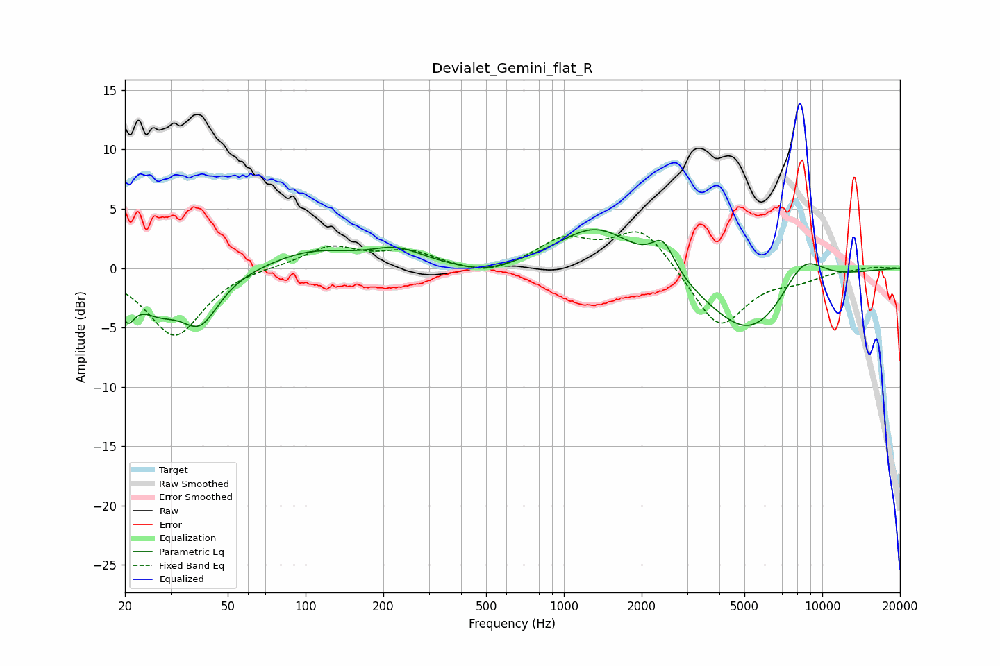

# Devialet_Gemini_flat_R
See [usage instructions](https://github.com/jaakkopasanen/AutoEq#usage) for more options and info.

### Parametric EQs
Apply preamp of -3.3 dB when using parametric equalizer.

|   # | Type    |   Fc (Hz) |    Q |   Gain (dB) |
|-----|---------|-----------|------|-------------|
|   1 | Peaking |        20 | 4.9  |        -2.7 |
|   2 | Peaking |        27 | 1.61 |        -2.7 |
|   3 | Peaking |        39 | 1.91 |        -4   |
|   4 | Peaking |       106 | 0.9  |         1.5 |
|   5 | Peaking |       225 | 1.38 |         1.4 |
|   6 | Peaking |       493 | 1.34 |        -0.8 |
|   7 | Peaking |      1340 | 0.96 |         3.7 |
|   8 | Peaking |      2420 | 3.12 |         2.6 |
|   9 | Peaking |      5311 | 0.78 |        -6   |
|  10 | Peaking |      8377 | 1.5  |         3.4 |

### Fixed Band EQs
When using fixed band (also called graphic) equalizer, apply preamp of **-3.2 dB** (if available) and set gains manually with these parameters.

|   # | Type    |   Fc (Hz) |    Q |   Gain (dB) |
|-----|---------|-----------|------|-------------|
|   1 | Peaking |        31 | 1.41 |        -5.7 |
|   2 | Peaking |        62 | 1.41 |         0.2 |
|   3 | Peaking |       125 | 1.41 |         1.8 |
|   4 | Peaking |       250 | 1.41 |         1.3 |
|   5 | Peaking |       500 | 1.41 |        -0.8 |
|   6 | Peaking |      1000 | 1.41 |         2.3 |
|   7 | Peaking |      2000 | 1.41 |         3.5 |
|   8 | Peaking |      4000 | 1.41 |        -5.2 |
|   9 | Peaking |      8000 | 1.41 |        -0.8 |
|  10 | Peaking |     16000 | 1.41 |         0.1 |

### Graphs

