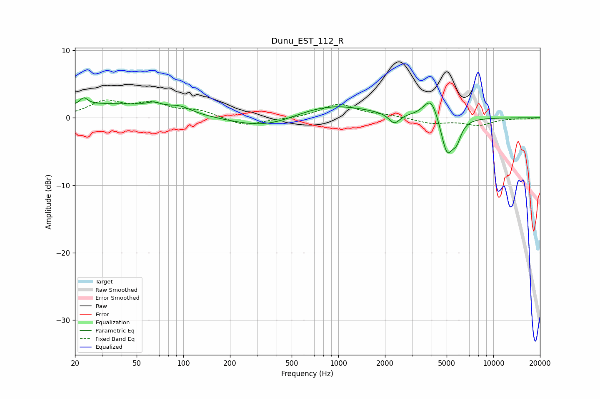

# Dunu_EST_112_R
See [usage instructions](https://github.com/jaakkopasanen/AutoEq#usage) for more options and info.

### Parametric EQs
Apply preamp of -3.1 dB when using parametric equalizer.

|   # | Type    |   Fc (Hz) |    Q |   Gain (dB) |
|-----|---------|-----------|------|-------------|
|   1 | Peaking |        23 | 5.74 |         1.1 |
|   2 | Peaking |        32 | 0.37 |         2   |
|   3 | Peaking |        64 | 3    |         0.7 |
|   4 | Peaking |        95 | 2    |         0.9 |
|   5 | Peaking |       345 | 0.67 |        -1.8 |
|   6 | Peaking |       860 | 0.57 |         2.2 |
|   7 | Peaking |      2296 | 4.08 |        -1.5 |
|   8 | Peaking |      3968 | 2.91 |         3.4 |
|   9 | Peaking |      5023 | 3.45 |        -5.6 |
|  10 | Peaking |      5804 | 4.76 |        -2.2 |

### Fixed Band EQs
When using fixed band (also called graphic) equalizer, apply preamp of **-2.7 dB** (if available) and set gains manually with these parameters.

|   # | Type    |   Fc (Hz) |    Q |   Gain (dB) |
|-----|---------|-----------|------|-------------|
|   1 | Peaking |        31 | 1.41 |         2.3 |
|   2 | Peaking |        62 | 1.41 |         1.8 |
|   3 | Peaking |       125 | 1.41 |         1   |
|   4 | Peaking |       250 | 1.41 |        -1.2 |
|   5 | Peaking |       500 | 1.41 |        -0.2 |
|   6 | Peaking |      1000 | 1.41 |         2   |
|   7 | Peaking |      2000 | 1.41 |         0.3 |
|   8 | Peaking |      4000 | 1.41 |        -0.8 |
|   9 | Peaking |      8000 | 1.41 |        -1   |
|  10 | Peaking |     16000 | 1.41 |        -0.1 |

### Graphs

