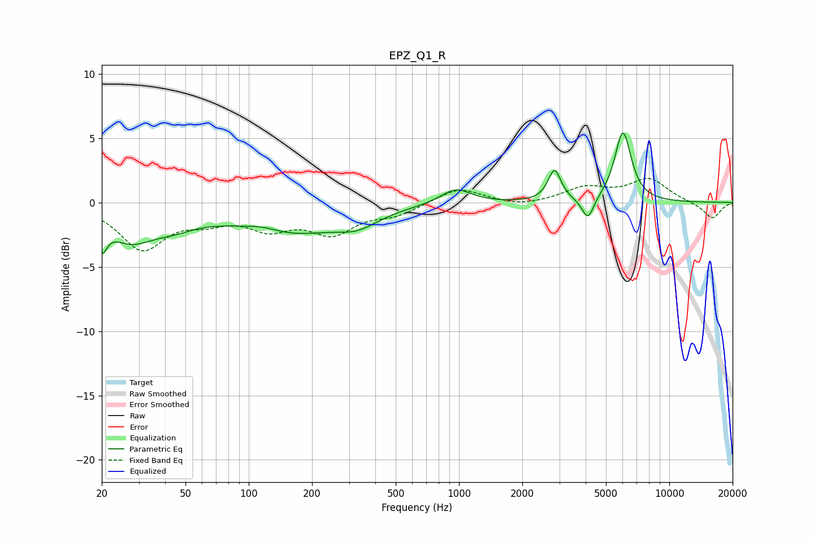

# EPZ_Q1_R
See [usage instructions](https://github.com/jaakkopasanen/AutoEq#usage) for more options and info.

### Parametric EQs
Apply preamp of -5.5 dB when using parametric equalizer.

|   # | Type    |   Fc (Hz) |    Q |   Gain (dB) |
|-----|---------|-----------|------|-------------|
|   1 | Peaking |        20 | 5.71 |        -2.2 |
|   2 | Peaking |        27 | 1.31 |        -2.4 |
|   3 | Peaking |        44 | 1.2  |        -1.1 |
|   4 | Peaking |       116 | 1.59 |         0.5 |
|   5 | Peaking |       151 | 0.56 |        -2.4 |
|   6 | Peaking |       329 | 1.43 |        -1   |
|   7 | Peaking |       966 | 1.95 |         1.2 |
|   8 | Peaking |      2845 | 4.67 |         2.4 |
|   9 | Peaking |      4102 | 4.99 |        -1.8 |
|  10 | Peaking |      6018 | 3.53 |         5.5 |

### Fixed Band EQs
When using fixed band (also called graphic) equalizer, apply preamp of **-2.0 dB** (if available) and set gains manually with these parameters.

|   # | Type    |   Fc (Hz) |    Q |   Gain (dB) |
|-----|---------|-----------|------|-------------|
|   1 | Peaking |        31 | 1.41 |        -3.5 |
|   2 | Peaking |        62 | 1.41 |        -1   |
|   3 | Peaking |       125 | 1.41 |        -1.7 |
|   4 | Peaking |       250 | 1.41 |        -2.2 |
|   5 | Peaking |       500 | 1.41 |        -0.8 |
|   6 | Peaking |      1000 | 1.41 |         1.2 |
|   7 | Peaking |      2000 | 1.41 |        -0.3 |
|   8 | Peaking |      4000 | 1.41 |         1.1 |
|   9 | Peaking |      8000 | 1.41 |         1.8 |
|  10 | Peaking |     16000 | 1.41 |        -1.3 |

### Graphs

