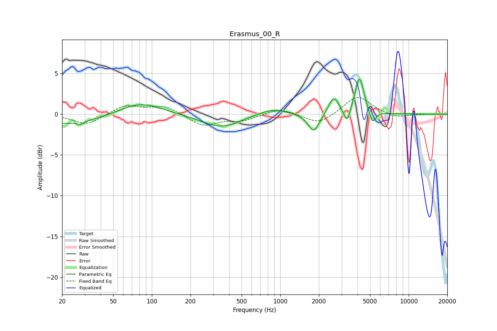

# Erasmus_00_R
See [usage instructions](https://github.com/jaakkopasanen/AutoEq#usage) for more options and info.

### Parametric EQs
Apply preamp of -4.4 dB when using parametric equalizer.

|   # | Type    |   Fc (Hz) |    Q |   Gain (dB) |
|-----|---------|-----------|------|-------------|
|   1 | Peaking |        20 | 0.43 |        -1.3 |
|   2 | Peaking |        28 | 5.82 |        -0.4 |
|   3 | Peaking |        81 | 0.84 |         1.6 |
|   4 | Peaking |       345 | 0.92 |        -1.7 |
|   5 | Peaking |       869 | 1.23 |         0.8 |
|   6 | Peaking |      1823 | 3.2  |        -2.3 |
|   7 | Peaking |      2604 | 3.7  |         2.1 |
|   8 | Peaking |      3322 | 5.88 |        -1.9 |
|   9 | Peaking |      4142 | 4.07 |         4.6 |
|  10 | Peaking |      5223 | 5.64 |        -1.7 |

### Fixed Band EQs
When using fixed band (also called graphic) equalizer, apply preamp of **-2.1 dB** (if available) and set gains manually with these parameters.

|   # | Type    |   Fc (Hz) |    Q |   Gain (dB) |
|-----|---------|-----------|------|-------------|
|   1 | Peaking |        31 | 1.41 |        -1.3 |
|   2 | Peaking |        62 | 1.41 |         1.1 |
|   3 | Peaking |       125 | 1.41 |         1   |
|   4 | Peaking |       250 | 1.41 |        -1.4 |
|   5 | Peaking |       500 | 1.41 |        -0.8 |
|   6 | Peaking |      1000 | 1.41 |         0.8 |
|   7 | Peaking |      2000 | 1.41 |        -1.3 |
|   8 | Peaking |      4000 | 1.41 |         2.3 |
|   9 | Peaking |      8000 | 1.41 |        -0.5 |
|  10 | Peaking |     16000 | 1.41 |         0   |

### Graphs

