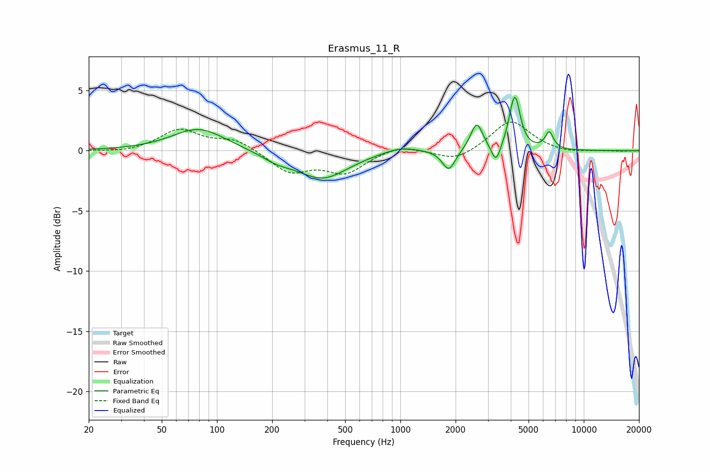

# Erasmus_11_R
See [usage instructions](https://github.com/jaakkopasanen/AutoEq#usage) for more options and info.

### Parametric EQs
Apply preamp of -4.6 dB when using parametric equalizer.

|   # | Type    |   Fc (Hz) |    Q |   Gain (dB) |
|-----|---------|-----------|------|-------------|
|   1 | Peaking |        80 | 0.99 |         1.9 |
|   2 | Peaking |       211 | 1.73 |        -0.6 |
|   3 | Peaking |       376 | 1.01 |        -2.3 |
|   4 | Peaking |      1002 | 1.49 |         0.5 |
|   5 | Peaking |      1837 | 4.04 |        -1.7 |
|   6 | Peaking |      2607 | 4.35 |         2.3 |
|   7 | Peaking |      3322 | 5.99 |        -1.5 |
|   8 | Peaking |      4082 | 5.26 |         0.9 |
|   9 | Peaking |      4230 | 5.13 |         3.7 |
|  10 | Peaking |      6483 | 6    |         1.4 |

### Fixed Band EQs
When using fixed band (also called graphic) equalizer, apply preamp of **-2.5 dB** (if available) and set gains manually with these parameters.

|   # | Type    |   Fc (Hz) |    Q |   Gain (dB) |
|-----|---------|-----------|------|-------------|
|   1 | Peaking |        31 | 1.41 |        -0.2 |
|   2 | Peaking |        62 | 1.41 |         1.7 |
|   3 | Peaking |       125 | 1.41 |         0.9 |
|   4 | Peaking |       250 | 1.41 |        -1.7 |
|   5 | Peaking |       500 | 1.41 |        -1.7 |
|   6 | Peaking |      1000 | 1.41 |         0.6 |
|   7 | Peaking |      2000 | 1.41 |        -0.9 |
|   8 | Peaking |      4000 | 1.41 |         2.6 |
|   9 | Peaking |      8000 | 1.41 |        -0.2 |
|  10 | Peaking |     16000 | 1.41 |        -0.1 |

### Graphs

