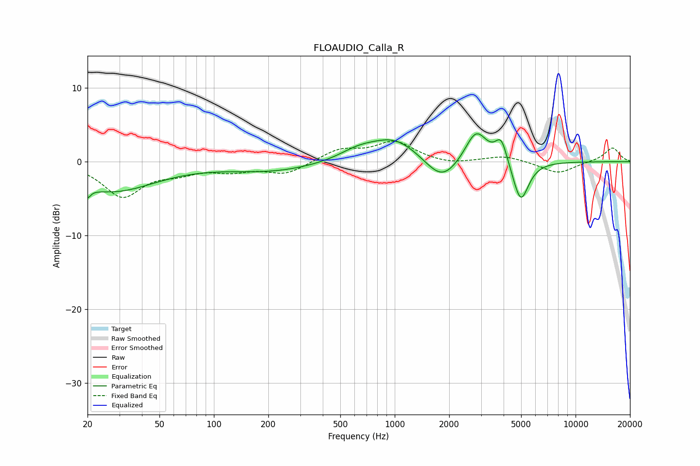

# FLOAUDIO_Calla_R
See [usage instructions](https://github.com/jaakkopasanen/AutoEq#usage) for more options and info.

### Parametric EQs
Apply preamp of -3.9 dB when using parametric equalizer.

|   # | Type    |   Fc (Hz) |    Q |   Gain (dB) |
|-----|---------|-----------|------|-------------|
|   1 | Peaking |        20 | 5.9  |        -4.2 |
|   2 | Peaking |        20 | 5.92 |         2.8 |
|   3 | Peaking |        27 | 0.59 |        -3.9 |
|   4 | Peaking |       212 | 0.57 |        -1.3 |
|   5 | Peaking |       624 | 1.36 |         1.2 |
|   6 | Peaking |       998 | 1.02 |         3.2 |
|   7 | Peaking |      1827 | 1.53 |        -3.4 |
|   8 | Peaking |      2819 | 2.33 |         4.5 |
|   9 | Peaking |      3883 | 4.24 |         3.2 |
|  10 | Peaking |      4973 | 3.2  |        -5.7 |

### Fixed Band EQs
When using fixed band (also called graphic) equalizer, apply preamp of **-2.9 dB** (if available) and set gains manually with these parameters.

|   # | Type    |   Fc (Hz) |    Q |   Gain (dB) |
|-----|---------|-----------|------|-------------|
|   1 | Peaking |        31 | 1.41 |        -4.6 |
|   2 | Peaking |        62 | 1.41 |        -1.2 |
|   3 | Peaking |       125 | 1.41 |        -1   |
|   4 | Peaking |       250 | 1.41 |        -1.6 |
|   5 | Peaking |       500 | 1.41 |         1.6 |
|   6 | Peaking |      1000 | 1.41 |         2.6 |
|   7 | Peaking |      2000 | 1.41 |        -0.5 |
|   8 | Peaking |      4000 | 1.41 |         0.8 |
|   9 | Peaking |      8000 | 1.41 |        -1.6 |
|  10 | Peaking |     16000 | 1.41 |         1.9 |

### Graphs

