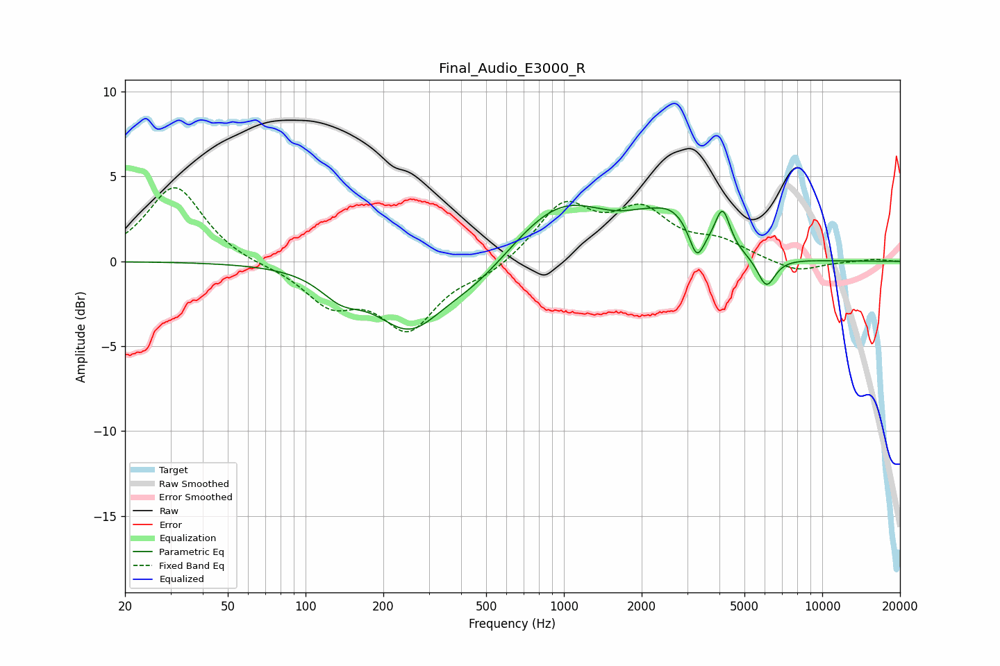

# Final_Audio_E3000_R
See [usage instructions](https://github.com/jaakkopasanen/AutoEq#usage) for more options and info.

### Parametric EQs
Apply preamp of -3.4 dB when using parametric equalizer.

|   # | Type    |   Fc (Hz) |    Q |   Gain (dB) |
|-----|---------|-----------|------|-------------|
|   1 | Peaking |       137 | 1.72 |        -1.4 |
|   2 | Peaking |       251 | 1.09 |        -3.6 |
|   3 | Peaking |       459 | 0.96 |        -1.5 |
|   4 | Peaking |       982 | 0.73 |         3.6 |
|   5 | Peaking |      2007 | 1.68 |         0.7 |
|   6 | Peaking |      2650 | 1.63 |         1.9 |
|   7 | Peaking |      3268 | 4.99 |        -1.8 |
|   8 | Peaking |      4055 | 4.07 |         0.5 |
|   9 | Peaking |      4125 | 5.07 |         1.9 |
|  10 | Peaking |      6078 | 3.98 |        -1.8 |

### Fixed Band EQs
When using fixed band (also called graphic) equalizer, apply preamp of **-4.4 dB** (if available) and set gains manually with these parameters.

|   # | Type    |   Fc (Hz) |    Q |   Gain (dB) |
|-----|---------|-----------|------|-------------|
|   1 | Peaking |        31 | 1.41 |         4.5 |
|   2 | Peaking |        62 | 1.41 |        -0.2 |
|   3 | Peaking |       125 | 1.41 |        -2.3 |
|   4 | Peaking |       250 | 1.41 |        -3.8 |
|   5 | Peaking |       500 | 1.41 |        -0.7 |
|   6 | Peaking |      1000 | 1.41 |         3.3 |
|   7 | Peaking |      2000 | 1.41 |         2.7 |
|   8 | Peaking |      4000 | 1.41 |         1   |
|   9 | Peaking |      8000 | 1.41 |        -0.7 |
|  10 | Peaking |     16000 | 1.41 |         0.1 |

### Graphs

