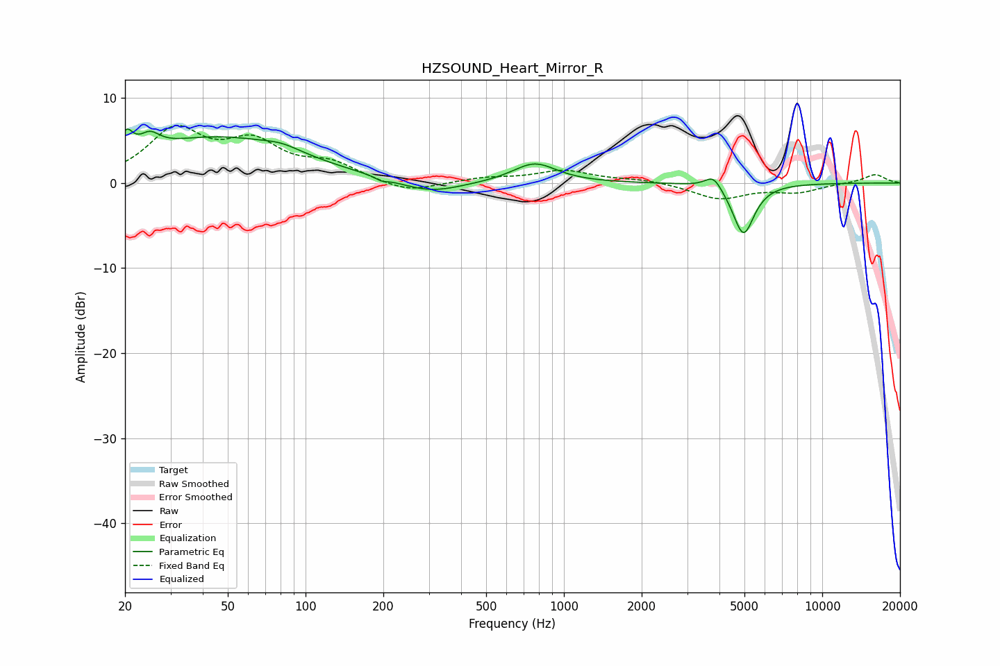

# HZSOUND_Heart_Mirror_R
See [usage instructions](https://github.com/jaakkopasanen/AutoEq#usage) for more options and info.

### Parametric EQs
Apply preamp of -6.4 dB when using parametric equalizer.

|   # | Type    |   Fc (Hz) |    Q |   Gain (dB) |
|-----|---------|-----------|------|-------------|
|   1 | Peaking |        20 | 5.66 |         2.6 |
|   2 | Peaking |        25 | 3.72 |         1.7 |
|   3 | Peaking |        45 | 0.45 |         5.2 |
|   4 | Peaking |        81 | 1.89 |         0.7 |
|   5 | Peaking |       199 | 5.97 |        -3.3 |
|   6 | Peaking |       199 | 5.99 |         2.9 |
|   7 | Peaking |       302 | 1.16 |        -1.5 |
|   8 | Peaking |       770 | 1.67 |         2.3 |
|   9 | Peaking |      3792 | 4.33 |         1.6 |
|  10 | Peaking |      4956 | 3.39 |        -6.1 |

### Fixed Band EQs
When using fixed band (also called graphic) equalizer, apply preamp of **-6.9 dB** (if available) and set gains manually with these parameters.

|   # | Type    |   Fc (Hz) |    Q |   Gain (dB) |
|-----|---------|-----------|------|-------------|
|   1 | Peaking |        31 | 1.41 |         5.9 |
|   2 | Peaking |        62 | 1.41 |         4.2 |
|   3 | Peaking |       125 | 1.41 |         2   |
|   4 | Peaking |       250 | 1.41 |        -1.3 |
|   5 | Peaking |       500 | 1.41 |         0.5 |
|   6 | Peaking |      1000 | 1.41 |         1.4 |
|   7 | Peaking |      2000 | 1.41 |         0.4 |
|   8 | Peaking |      4000 | 1.41 |        -1.8 |
|   9 | Peaking |      8000 | 1.41 |        -1   |
|  10 | Peaking |     16000 | 1.41 |         1   |

### Graphs

