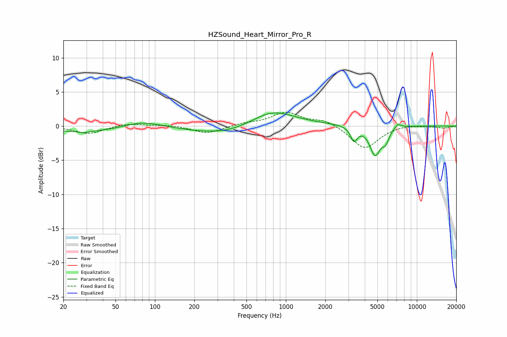

# HZSound_Heart_Mirror_Pro_R
See [usage instructions](https://github.com/jaakkopasanen/AutoEq#usage) for more options and info.

### Parametric EQs
Apply preamp of -2.0 dB when using parametric equalizer.

|   # | Type    |   Fc (Hz) |    Q |   Gain (dB) |
|-----|---------|-----------|------|-------------|
|   1 | Peaking |        29 | 4.64 |        -0.2 |
|   2 | Peaking |        30 | 0.49 |        -0.9 |
|   3 | Peaking |        80 | 0.99 |         1   |
|   4 | Peaking |       351 | 0.54 |        -1.4 |
|   5 | Peaking |       780 | 0.85 |         2.4 |
|   6 | Peaking |      1623 | 0.18 |         0.2 |
|   7 | Peaking |      3308 | 5.32 |        -2.1 |
|   8 | Peaking |      4801 | 3.35 |        -4.2 |
|   9 | Peaking |      5779 | 5.32 |        -1.6 |
|  10 | Peaking |      7165 | 5.57 |         0.7 |

### Fixed Band EQs
When using fixed band (also called graphic) equalizer, apply preamp of **-2.1 dB** (if available) and set gains manually with these parameters.

|   # | Type    |   Fc (Hz) |    Q |   Gain (dB) |
|-----|---------|-----------|------|-------------|
|   1 | Peaking |        31 | 1.41 |        -1.1 |
|   2 | Peaking |        62 | 1.41 |         0.4 |
|   3 | Peaking |       125 | 1.41 |         0.2 |
|   4 | Peaking |       250 | 1.41 |        -1.1 |
|   5 | Peaking |       500 | 1.41 |         0.4 |
|   6 | Peaking |      1000 | 1.41 |         1.9 |
|   7 | Peaking |      2000 | 1.41 |         0.9 |
|   8 | Peaking |      4000 | 1.41 |        -3.4 |
|   9 | Peaking |      8000 | 1.41 |         0.2 |
|  10 | Peaking |     16000 | 1.41 |        -0.3 |

### Graphs

