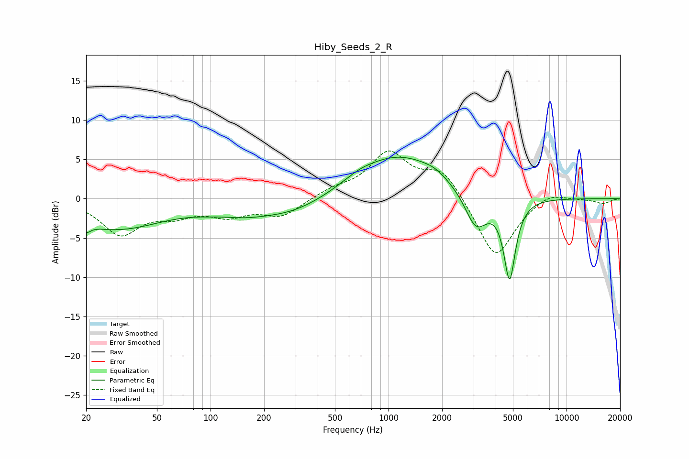

# Hiby_Seeds_2_R
See [usage instructions](https://github.com/jaakkopasanen/AutoEq#usage) for more options and info.

### Parametric EQs
Apply preamp of -5.4 dB when using parametric equalizer.

|   # | Type    |   Fc (Hz) |    Q |   Gain (dB) |
|-----|---------|-----------|------|-------------|
|   1 | Peaking |        20 | 5.92 |        -1   |
|   2 | Peaking |        29 | 0.52 |        -3.8 |
|   3 | Peaking |       102 | 1.13 |        -0.5 |
|   4 | Peaking |       155 | 1.27 |        -0.7 |
|   5 | Peaking |       276 | 0.64 |        -2.2 |
|   6 | Peaking |       685 | 1.65 |         0.6 |
|   7 | Peaking |      1147 | 0.57 |         5.6 |
|   8 | Peaking |      1814 | 2.32 |         0.5 |
|   9 | Peaking |      3098 | 2.19 |        -4.8 |
|  10 | Peaking |      4789 | 4.18 |       -10.3 |

### Fixed Band EQs
When using fixed band (also called graphic) equalizer, apply preamp of **-6.2 dB** (if available) and set gains manually with these parameters.

|   # | Type    |   Fc (Hz) |    Q |   Gain (dB) |
|-----|---------|-----------|------|-------------|
|   1 | Peaking |        31 | 1.41 |        -4.4 |
|   2 | Peaking |        62 | 1.41 |        -1.7 |
|   3 | Peaking |       125 | 1.41 |        -1.9 |
|   4 | Peaking |       250 | 1.41 |        -2.2 |
|   5 | Peaking |       500 | 1.41 |         1   |
|   6 | Peaking |      1000 | 1.41 |         5.6 |
|   7 | Peaking |      2000 | 1.41 |         3.6 |
|   8 | Peaking |      4000 | 1.41 |        -7.8 |
|   9 | Peaking |      8000 | 1.41 |         1.1 |
|  10 | Peaking |     16000 | 1.41 |        -0.6 |

### Graphs

