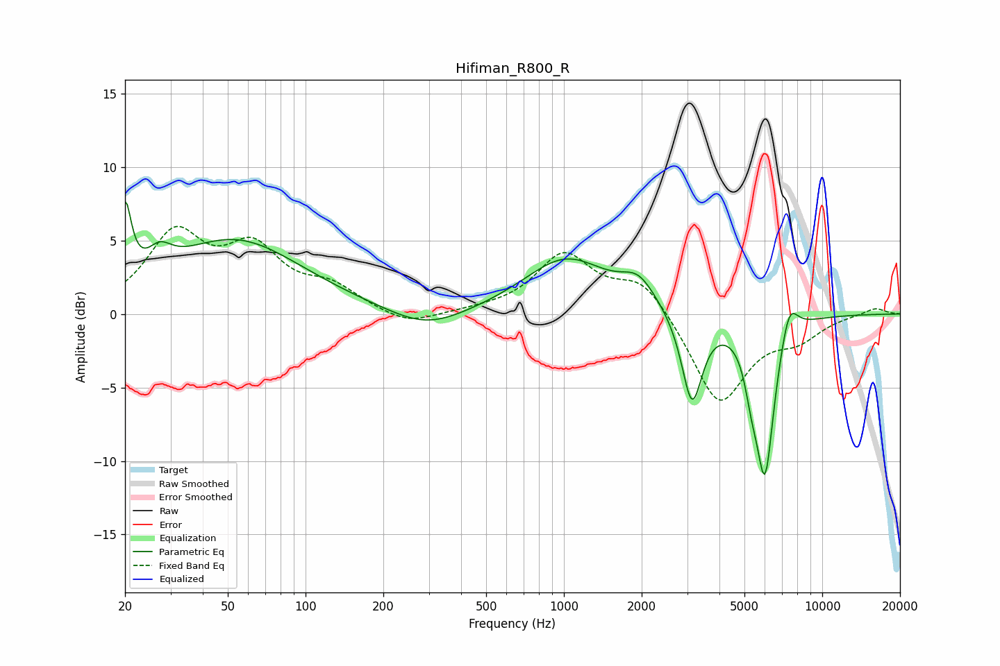

# Hifiman_R800_R
See [usage instructions](https://github.com/jaakkopasanen/AutoEq#usage) for more options and info.

### Parametric EQs
Apply preamp of -7.8 dB when using parametric equalizer.

|   # | Type    |   Fc (Hz) |    Q |   Gain (dB) |
|-----|---------|-----------|------|-------------|
|   1 | Peaking |        20 | 6    |         5.3 |
|   2 | Peaking |        27 | 3.01 |         1.4 |
|   3 | Peaking |        53 | 0.54 |         5   |
|   4 | Peaking |       294 | 0.96 |        -1.4 |
|   5 | Peaking |      1019 | 0.87 |         3.7 |
|   6 | Peaking |      1944 | 2.13 |         1.7 |
|   7 | Peaking |      3133 | 3.52 |        -6.2 |
|   8 | Peaking |      5319 | 5.53 |        -1.9 |
|   9 | Peaking |      6000 | 3.71 |       -10.7 |
|  10 | Peaking |      7449 | 4.03 |         2.4 |

### Fixed Band EQs
When using fixed band (also called graphic) equalizer, apply preamp of **-6.1 dB** (if available) and set gains manually with these parameters.

|   # | Type    |   Fc (Hz) |    Q |   Gain (dB) |
|-----|---------|-----------|------|-------------|
|   1 | Peaking |        31 | 1.41 |         5.1 |
|   2 | Peaking |        62 | 1.41 |         4   |
|   3 | Peaking |       125 | 1.41 |         1.6 |
|   4 | Peaking |       250 | 1.41 |        -0.9 |
|   5 | Peaking |       500 | 1.41 |         0.1 |
|   6 | Peaking |      1000 | 1.41 |         3.9 |
|   7 | Peaking |      2000 | 1.41 |         2.4 |
|   8 | Peaking |      4000 | 1.41 |        -6.2 |
|   9 | Peaking |      8000 | 1.41 |        -1.4 |
|  10 | Peaking |     16000 | 1.41 |         0.5 |

### Graphs

