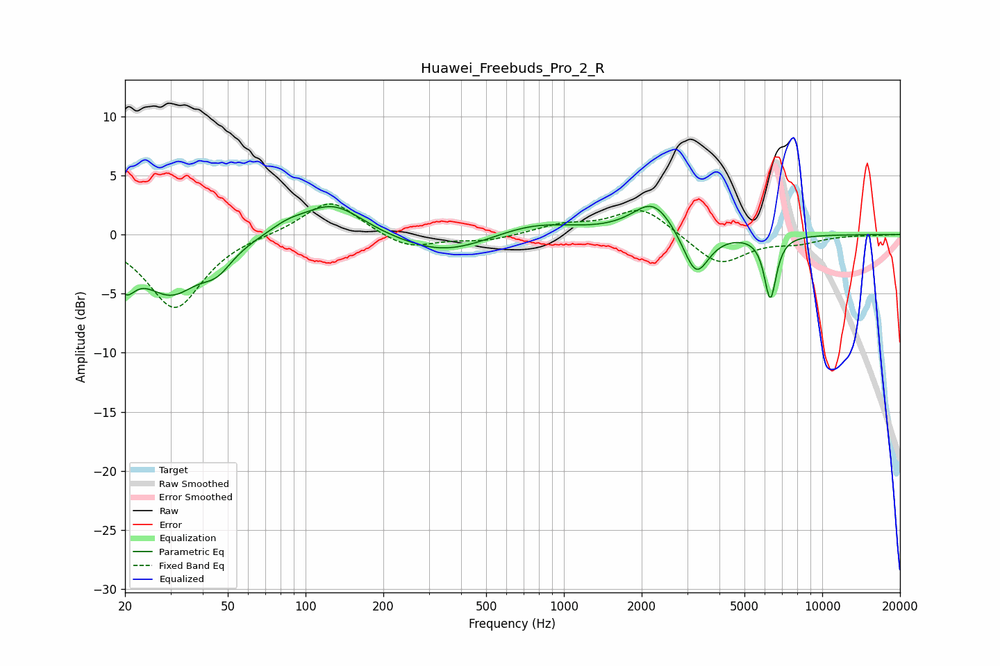

# Huawei_Freebuds_Pro_2_R
See [usage instructions](https://github.com/jaakkopasanen/AutoEq#usage) for more options and info.

### Parametric EQs
Apply preamp of -2.5 dB when using parametric equalizer.

|   # | Type    |   Fc (Hz) |    Q |   Gain (dB) |
|-----|---------|-----------|------|-------------|
|   1 | Peaking |        20 | 3.68 |        -2.8 |
|   2 | Peaking |        30 | 1.25 |        -4.7 |
|   3 | Peaking |        45 | 2.39 |        -1.7 |
|   4 | Peaking |        85 | 2.04 |         0.7 |
|   5 | Peaking |       127 | 1.21 |         2.8 |
|   6 | Peaking |       344 | 0.8  |        -1.8 |
|   7 | Peaking |       767 | 0.88 |         1.1 |
|   8 | Peaking |      2218 | 1.78 |         2.9 |
|   9 | Peaking |      3247 | 2.85 |        -3.9 |
|  10 | Peaking |      6295 | 5.91 |        -5.3 |

### Fixed Band EQs
When using fixed band (also called graphic) equalizer, apply preamp of **-2.7 dB** (if available) and set gains manually with these parameters.

|   # | Type    |   Fc (Hz) |    Q |   Gain (dB) |
|-----|---------|-----------|------|-------------|
|   1 | Peaking |        31 | 1.41 |        -6.3 |
|   2 | Peaking |        62 | 1.41 |         0.1 |
|   3 | Peaking |       125 | 1.41 |         3   |
|   4 | Peaking |       250 | 1.41 |        -1.3 |
|   5 | Peaking |       500 | 1.41 |        -0.5 |
|   6 | Peaking |      1000 | 1.41 |         0.8 |
|   7 | Peaking |      2000 | 1.41 |         2.4 |
|   8 | Peaking |      4000 | 1.41 |        -2.6 |
|   9 | Peaking |      8000 | 1.41 |        -0.6 |
|  10 | Peaking |     16000 | 1.41 |        -0   |

### Graphs

