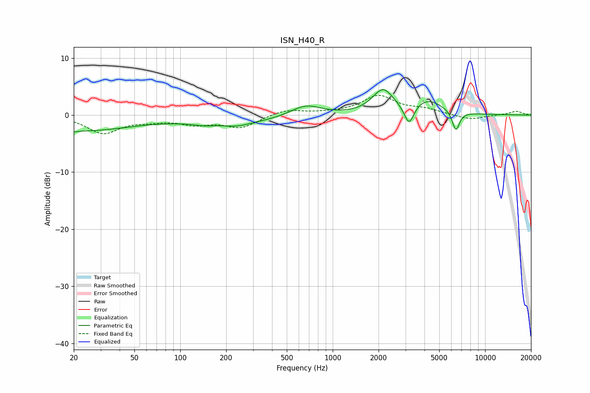

# ISN_H40_R
See [usage instructions](https://github.com/jaakkopasanen/AutoEq#usage) for more options and info.

### Parametric EQs
Apply preamp of -4.5 dB when using parametric equalizer.

|   # | Type    |   Fc (Hz) |    Q |   Gain (dB) |
|-----|---------|-----------|------|-------------|
|   1 | Peaking |        20 | 5.77 |        -0.2 |
|   2 | Peaking |        23 | 0.43 |        -2.7 |
|   3 | Peaking |       145 | 1.97 |        -0.4 |
|   4 | Peaking |       228 | 0.43 |        -1.3 |
|   5 | Peaking |       237 | 1.76 |        -0.6 |
|   6 | Peaking |       664 | 1.39 |         2   |
|   7 | Peaking |      2137 | 2.06 |         4.2 |
|   8 | Peaking |      3170 | 4.39 |        -3.7 |
|   9 | Peaking |      4193 | 1.36 |         2.5 |
|  10 | Peaking |      6433 | 5.77 |        -3.5 |

### Fixed Band EQs
When using fixed band (also called graphic) equalizer, apply preamp of **-3.5 dB** (if available) and set gains manually with these parameters.

|   # | Type    |   Fc (Hz) |    Q |   Gain (dB) |
|-----|---------|-----------|------|-------------|
|   1 | Peaking |        31 | 1.41 |        -3.1 |
|   2 | Peaking |        62 | 1.41 |        -0.7 |
|   3 | Peaking |       125 | 1.41 |        -1.4 |
|   4 | Peaking |       250 | 1.41 |        -2.1 |
|   5 | Peaking |       500 | 1.41 |         1   |
|   6 | Peaking |      1000 | 1.41 |         0.3 |
|   7 | Peaking |      2000 | 1.41 |         3.3 |
|   8 | Peaking |      4000 | 1.41 |         0.9 |
|   9 | Peaking |      8000 | 1.41 |        -0.9 |
|  10 | Peaking |     16000 | 1.41 |         0.7 |

### Graphs

