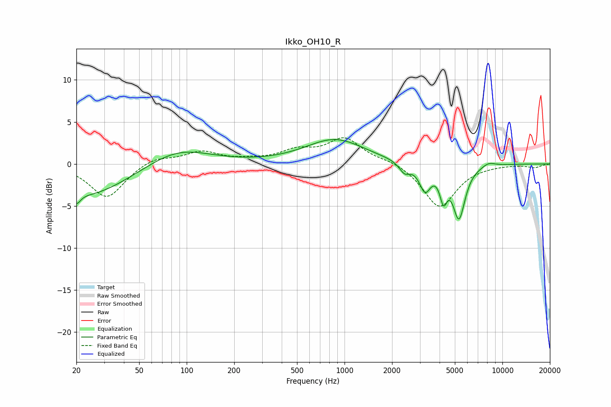

# Ikko_OH10_R
See [usage instructions](https://github.com/jaakkopasanen/AutoEq#usage) for more options and info.

### Parametric EQs
Apply preamp of -3.0 dB when using parametric equalizer.

|   # | Type    |   Fc (Hz) |    Q |   Gain (dB) |
|-----|---------|-----------|------|-------------|
|   1 | Peaking |        20 | 5.86 |        -1.2 |
|   2 | Peaking |        23 | 0.53 |        -3.8 |
|   3 | Peaking |        88 | 0.71 |         2.1 |
|   4 | Peaking |       870 | 0.76 |         2.9 |
|   5 | Peaking |      2400 | 4.2  |        -1.2 |
|   6 | Peaking |      3236 | 3.95 |        -3   |
|   7 | Peaking |      4235 | 6    |        -3.2 |
|   8 | Peaking |      5135 | 2.35 |         1   |
|   9 | Peaking |      5297 | 3.37 |        -7.2 |
|  10 | Peaking |      8182 | 3.23 |         0.5 |

### Fixed Band EQs
When using fixed band (also called graphic) equalizer, apply preamp of **-3.2 dB** (if available) and set gains manually with these parameters.

|   # | Type    |   Fc (Hz) |    Q |   Gain (dB) |
|-----|---------|-----------|------|-------------|
|   1 | Peaking |        31 | 1.41 |        -4.1 |
|   2 | Peaking |        62 | 1.41 |         0.9 |
|   3 | Peaking |       125 | 1.41 |         1.4 |
|   4 | Peaking |       250 | 1.41 |         0.3 |
|   5 | Peaking |       500 | 1.41 |         1.4 |
|   6 | Peaking |      1000 | 1.41 |         2.9 |
|   7 | Peaking |      2000 | 1.41 |         0.4 |
|   8 | Peaking |      4000 | 1.41 |        -5.2 |
|   9 | Peaking |      8000 | 1.41 |        -0.1 |
|  10 | Peaking |     16000 | 1.41 |        -0.4 |

### Graphs

