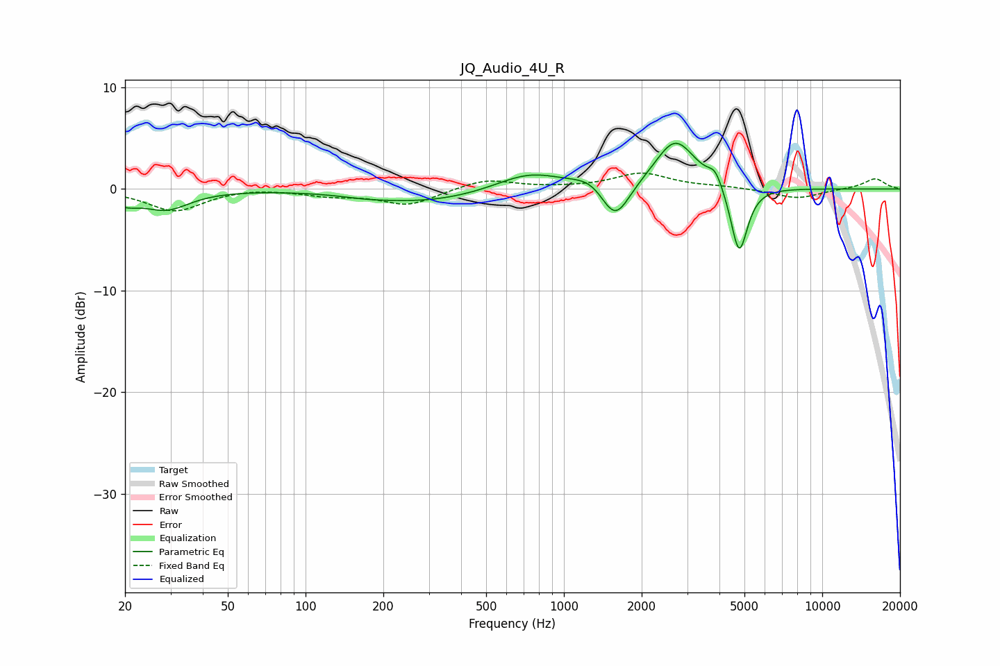

# JQ_Audio_4U_R
See [usage instructions](https://github.com/jaakkopasanen/AutoEq#usage) for more options and info.

### Parametric EQs
Apply preamp of -4.6 dB when using parametric equalizer.

|   # | Type    |   Fc (Hz) |    Q |   Gain (dB) |
|-----|---------|-----------|------|-------------|
|   1 | Peaking |        20 | 2.74 |        -1   |
|   2 | Peaking |        29 | 1.57 |        -1.9 |
|   3 | Peaking |       173 | 1.58 |        -0.2 |
|   4 | Peaking |       294 | 0.62 |        -1.3 |
|   5 | Peaking |       734 | 1.09 |         1.8 |
|   6 | Peaking |      1274 | 2.09 |         1   |
|   7 | Peaking |      1580 | 2.54 |        -3.9 |
|   8 | Peaking |      2701 | 1.8  |         4.9 |
|   9 | Peaking |      3857 | 5.03 |         1.4 |
|  10 | Peaking |      4769 | 4.3  |        -6.9 |

### Fixed Band EQs
When using fixed band (also called graphic) equalizer, apply preamp of **-1.7 dB** (if available) and set gains manually with these parameters.

|   # | Type    |   Fc (Hz) |    Q |   Gain (dB) |
|-----|---------|-----------|------|-------------|
|   1 | Peaking |        31 | 1.41 |        -2.1 |
|   2 | Peaking |        62 | 1.41 |         0.2 |
|   3 | Peaking |       125 | 1.41 |        -0.6 |
|   4 | Peaking |       250 | 1.41 |        -1.6 |
|   5 | Peaking |       500 | 1.41 |         1   |
|   6 | Peaking |      1000 | 1.41 |         0.1 |
|   7 | Peaking |      2000 | 1.41 |         1.5 |
|   8 | Peaking |      4000 | 1.41 |         0.2 |
|   9 | Peaking |      8000 | 1.41 |        -0.9 |
|  10 | Peaking |     16000 | 1.41 |         1   |

### Graphs

