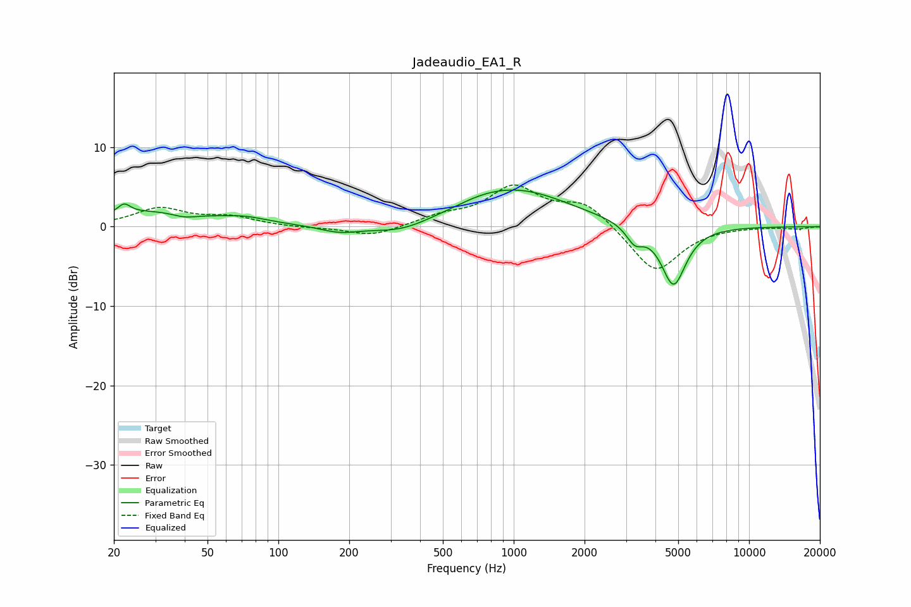

# Jadeaudio_EA1_R
See [usage instructions](https://github.com/jaakkopasanen/AutoEq#usage) for more options and info.

### Parametric EQs
Apply preamp of -4.7 dB when using parametric equalizer.

|   # | Type    |   Fc (Hz) |    Q |   Gain (dB) |
|-----|---------|-----------|------|-------------|
|   1 | Peaking |        22 | 5.52 |         1.2 |
|   2 | Peaking |        30 | 0.6  |         1.9 |
|   3 | Peaking |        40 | 2.58 |        -0.6 |
|   4 | Peaking |        72 | 1.52 |         0.6 |
|   5 | Peaking |       182 | 1.7  |        -0.9 |
|   6 | Peaking |       331 | 1.12 |        -1.3 |
|   7 | Peaking |       722 | 1.27 |         0.6 |
|   8 | Peaking |      1037 | 0.62 |         4.5 |
|   9 | Peaking |      3266 | 3.94 |        -2.1 |
|  10 | Peaking |      4776 | 2.63 |        -7.6 |

### Fixed Band EQs
When using fixed band (also called graphic) equalizer, apply preamp of **-5.3 dB** (if available) and set gains manually with these parameters.

|   # | Type    |   Fc (Hz) |    Q |   Gain (dB) |
|-----|---------|-----------|------|-------------|
|   1 | Peaking |        31 | 1.41 |         2.2 |
|   2 | Peaking |        62 | 1.41 |         1.1 |
|   3 | Peaking |       125 | 1.41 |        -0.1 |
|   4 | Peaking |       250 | 1.41 |        -1.3 |
|   5 | Peaking |       500 | 1.41 |         1.1 |
|   6 | Peaking |      1000 | 1.41 |         4.8 |
|   7 | Peaking |      2000 | 1.41 |         2.9 |
|   8 | Peaking |      4000 | 1.41 |        -5.9 |
|   9 | Peaking |      8000 | 1.41 |         0   |
|  10 | Peaking |     16000 | 1.41 |        -0.3 |

### Graphs

