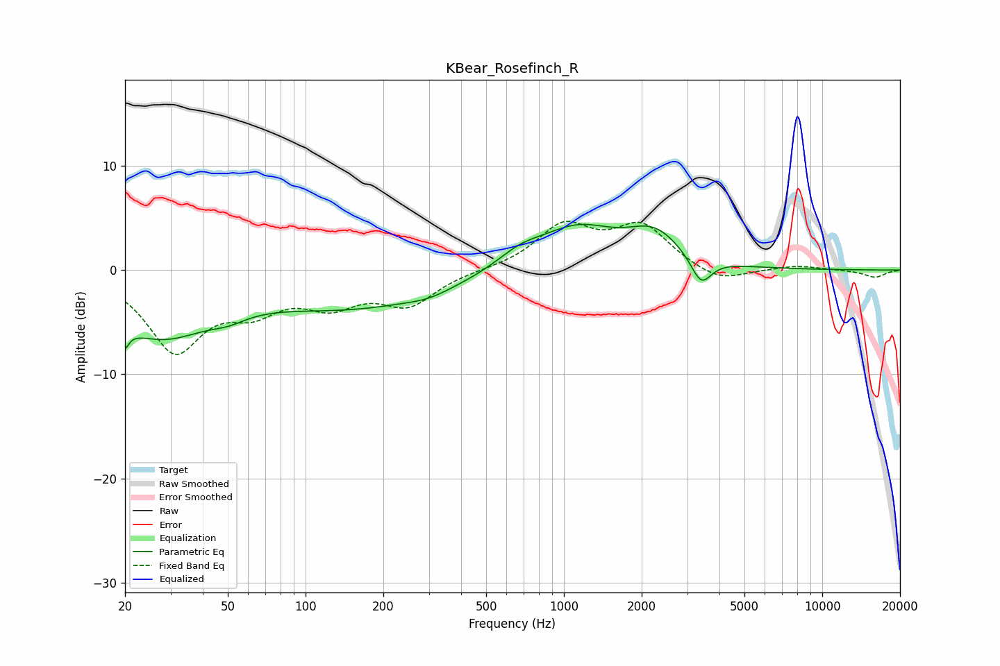

# KBear_Rosefinch_R
See [usage instructions](https://github.com/jaakkopasanen/AutoEq#usage) for more options and info.

### Parametric EQs
Apply preamp of -4.5 dB when using parametric equalizer.

|   # | Type    |   Fc (Hz) |    Q |   Gain (dB) |
|-----|---------|-----------|------|-------------|
|   1 | Peaking |        20 | 5.44 |        -5.8 |
|   2 | Peaking |        20 | 5.61 |         3.4 |
|   3 | Peaking |        27 | 0.72 |        -5.8 |
|   4 | Peaking |        50 | 2    |        -0.7 |
|   5 | Peaking |       155 | 0.39 |        -3.4 |
|   6 | Peaking |       301 | 1.68 |        -0.5 |
|   7 | Peaking |       676 | 1.51 |         1.4 |
|   8 | Peaking |      1127 | 0.94 |         3.8 |
|   9 | Peaking |      2241 | 1.34 |         3.1 |
|  10 | Peaking |      3399 | 3.54 |        -2.7 |

### Fixed Band EQs
When using fixed band (also called graphic) equalizer, apply preamp of **-4.8 dB** (if available) and set gains manually with these parameters.

|   # | Type    |   Fc (Hz) |    Q |   Gain (dB) |
|-----|---------|-----------|------|-------------|
|   1 | Peaking |        31 | 1.41 |        -7.4 |
|   2 | Peaking |        62 | 1.41 |        -3   |
|   3 | Peaking |       125 | 1.41 |        -2.8 |
|   4 | Peaking |       250 | 1.41 |        -3.1 |
|   5 | Peaking |       500 | 1.41 |         0   |
|   6 | Peaking |      1000 | 1.41 |         4.1 |
|   7 | Peaking |      2000 | 1.41 |         4   |
|   8 | Peaking |      4000 | 1.41 |        -1.4 |
|   9 | Peaking |      8000 | 1.41 |         0.4 |
|  10 | Peaking |     16000 | 1.41 |        -0.7 |

### Graphs

