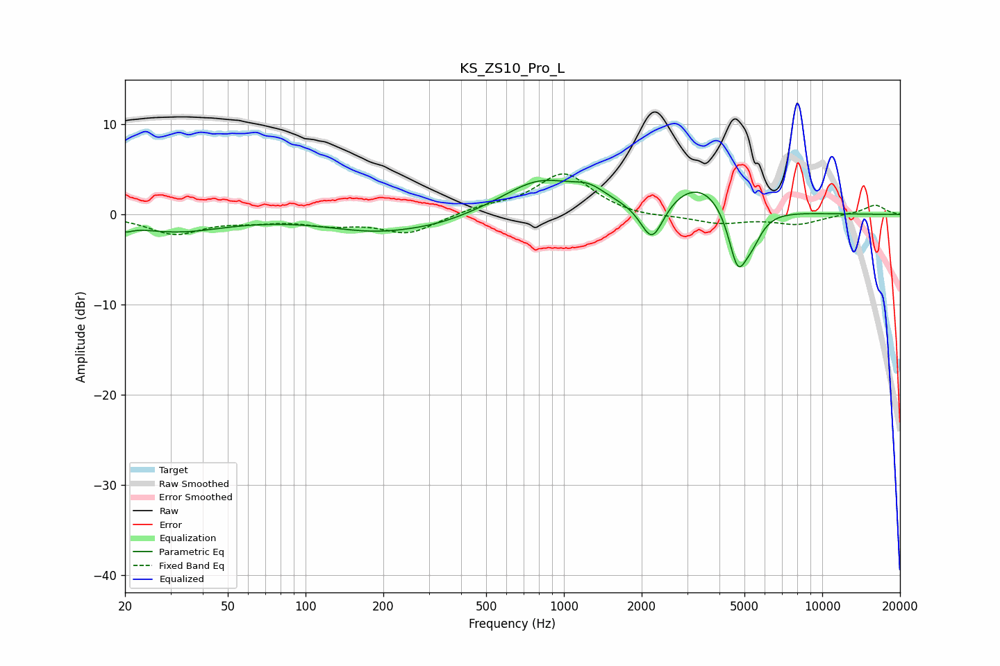

# KS_ZS10_Pro_L
See [usage instructions](https://github.com/jaakkopasanen/AutoEq#usage) for more options and info.

### Parametric EQs
Apply preamp of -3.9 dB when using parametric equalizer.

|   # | Type    |   Fc (Hz) |    Q |   Gain (dB) |
|-----|---------|-----------|------|-------------|
|   1 | Peaking |        20 | 5.22 |        -0.7 |
|   2 | Peaking |        31 | 0.75 |        -1.8 |
|   3 | Peaking |       192 | 0.7  |        -1.8 |
|   4 | Peaking |       335 | 1.1  |        -0.5 |
|   5 | Peaking |       805 | 0.99 |         3.6 |
|   6 | Peaking |      1252 | 2.15 |         1.4 |
|   7 | Peaking |      2195 | 3.11 |        -4.6 |
|   8 | Peaking |      3347 | 1.08 |         3.7 |
|   9 | Peaking |      4705 | 3.76 |        -6.5 |
|  10 | Peaking |      5342 | 3.32 |        -2.5 |

### Fixed Band EQs
When using fixed band (also called graphic) equalizer, apply preamp of **-4.6 dB** (if available) and set gains manually with these parameters.

|   # | Type    |   Fc (Hz) |    Q |   Gain (dB) |
|-----|---------|-----------|------|-------------|
|   1 | Peaking |        31 | 1.41 |        -2.1 |
|   2 | Peaking |        62 | 1.41 |        -0.5 |
|   3 | Peaking |       125 | 1.41 |        -0.9 |
|   4 | Peaking |       250 | 1.41 |        -2.1 |
|   5 | Peaking |       500 | 1.41 |         0.7 |
|   6 | Peaking |      1000 | 1.41 |         4.6 |
|   7 | Peaking |      2000 | 1.41 |        -0.4 |
|   8 | Peaking |      4000 | 1.41 |        -0.9 |
|   9 | Peaking |      8000 | 1.41 |        -1   |
|  10 | Peaking |     16000 | 1.41 |         1.1 |

### Graphs

