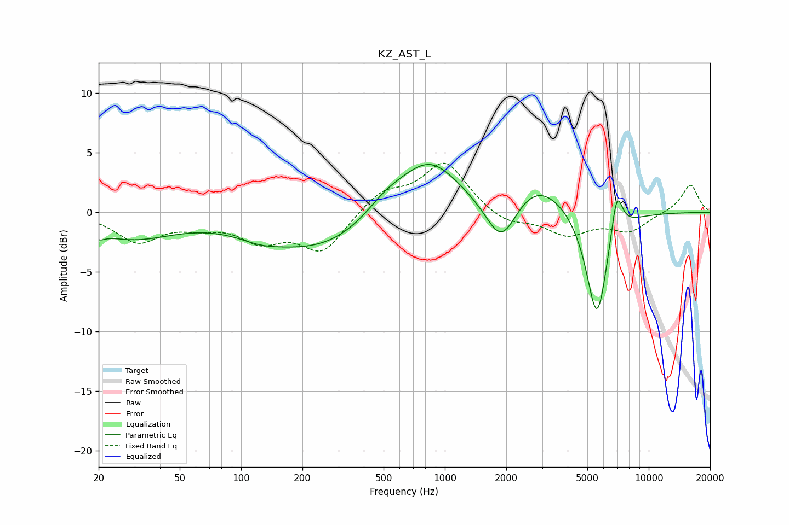

# KZ_AST_L
See [usage instructions](https://github.com/jaakkopasanen/AutoEq#usage) for more options and info.

### Parametric EQs
Apply preamp of -4.1 dB when using parametric equalizer.

|   # | Type    |   Fc (Hz) |    Q |   Gain (dB) |
|-----|---------|-----------|------|-------------|
|   1 | Peaking |        20 | 4.93 |        -0.6 |
|   2 | Peaking |        29 | 0.67 |        -2.1 |
|   3 | Peaking |       124 | 1.4  |        -0.6 |
|   4 | Peaking |       240 | 0.49 |        -3.1 |
|   5 | Peaking |       514 | 1.34 |         1.4 |
|   6 | Peaking |       836 | 0.95 |         4.5 |
|   7 | Peaking |      1896 | 1.79 |        -4.3 |
|   8 | Peaking |      2771 | 0.94 |         2.9 |
|   9 | Peaking |      5573 | 2.56 |        -9.5 |
|  10 | Peaking |      6971 | 4.76 |         3.9 |

### Fixed Band EQs
When using fixed band (also called graphic) equalizer, apply preamp of **-4.2 dB** (if available) and set gains manually with these parameters.

|   # | Type    |   Fc (Hz) |    Q |   Gain (dB) |
|-----|---------|-----------|------|-------------|
|   1 | Peaking |        31 | 1.41 |        -2.4 |
|   2 | Peaking |        62 | 1.41 |        -0.8 |
|   3 | Peaking |       125 | 1.41 |        -2.1 |
|   4 | Peaking |       250 | 1.41 |        -3.2 |
|   5 | Peaking |       500 | 1.41 |         1.7 |
|   6 | Peaking |      1000 | 1.41 |         4.2 |
|   7 | Peaking |      2000 | 1.41 |        -1   |
|   8 | Peaking |      4000 | 1.41 |        -1.8 |
|   9 | Peaking |      8000 | 1.41 |        -1.5 |
|  10 | Peaking |     16000 | 1.41 |         2.4 |

### Graphs

