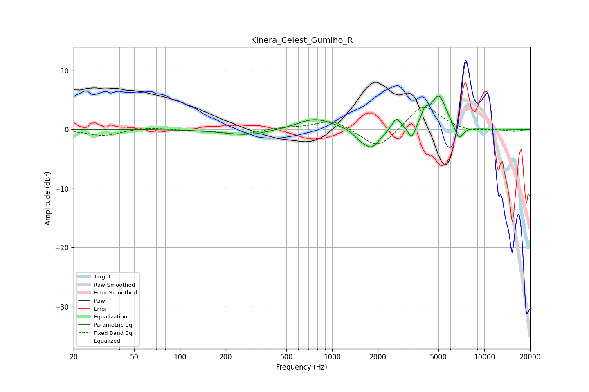

# Kinera_Celest_Gumiho_R
See [usage instructions](https://github.com/jaakkopasanen/AutoEq#usage) for more options and info.

### Parametric EQs
Apply preamp of -5.8 dB when using parametric equalizer.

|   # | Type    |   Fc (Hz) |    Q |   Gain (dB) |
|-----|---------|-----------|------|-------------|
|   1 | Peaking |       279 | 0.94 |        -1   |
|   2 | Peaking |       760 | 1.24 |         1.7 |
|   3 | Peaking |       981 | 0.87 |         0.3 |
|   4 | Peaking |      1518 | 3.31 |        -1   |
|   5 | Peaking |      1822 | 2.65 |        -3.1 |
|   6 | Peaking |      2646 | 5.11 |         2.1 |
|   7 | Peaking |      3336 | 5.99 |        -2.3 |
|   8 | Peaking |      4066 | 5.99 |         2   |
|   9 | Peaking |      5023 | 2.72 |         5.7 |
|  10 | Peaking |      6801 | 4.58 |        -2.5 |

### Fixed Band EQs
When using fixed band (also called graphic) equalizer, apply preamp of **-3.9 dB** (if available) and set gains manually with these parameters.

|   # | Type    |   Fc (Hz) |    Q |   Gain (dB) |
|-----|---------|-----------|------|-------------|
|   1 | Peaking |        31 | 1.41 |        -1   |
|   2 | Peaking |        62 | 1.41 |         0.4 |
|   3 | Peaking |       125 | 1.41 |        -0.2 |
|   4 | Peaking |       250 | 1.41 |        -0.8 |
|   5 | Peaking |       500 | 1.41 |         0.3 |
|   6 | Peaking |      1000 | 1.41 |         1.7 |
|   7 | Peaking |      2000 | 1.41 |        -3.5 |
|   8 | Peaking |      4000 | 1.41 |         4.4 |
|   9 | Peaking |      8000 | 1.41 |        -0.5 |
|  10 | Peaking |     16000 | 1.41 |        -0.3 |

### Graphs

