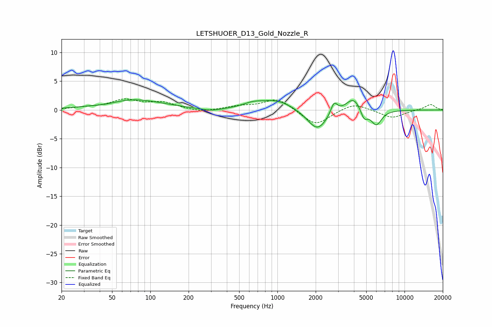

# LETSHUOER_D13_Gold_Nozzle_R
See [usage instructions](https://github.com/jaakkopasanen/AutoEq#usage) for more options and info.

### Parametric EQs
Apply preamp of -1.9 dB when using parametric equalizer.

|   # | Type    |   Fc (Hz) |    Q |   Gain (dB) |
|-----|---------|-----------|------|-------------|
|   1 | Peaking |        45 | 1.61 |        -0.3 |
|   2 | Peaking |        73 | 0.61 |         1.8 |
|   3 | Peaking |       300 | 1.65 |        -0.5 |
|   4 | Peaking |       635 | 1.84 |         0.7 |
|   5 | Peaking |       983 | 1.08 |         1.7 |
|   6 | Peaking |      2061 | 1.79 |        -3.7 |
|   7 | Peaking |      2787 | 5.47 |         2.1 |
|   8 | Peaking |      3971 | 2.34 |         2.5 |
|   9 | Peaking |      4805 | 5.12 |        -1.9 |
|  10 | Peaking |      5987 | 3.28 |        -2.7 |

### Fixed Band EQs
When using fixed band (also called graphic) equalizer, apply preamp of **-2.0 dB** (if available) and set gains manually with these parameters.

|   # | Type    |   Fc (Hz) |    Q |   Gain (dB) |
|-----|---------|-----------|------|-------------|
|   1 | Peaking |        31 | 1.41 |         0.3 |
|   2 | Peaking |        62 | 1.41 |         1.7 |
|   3 | Peaking |       125 | 1.41 |         1.2 |
|   4 | Peaking |       250 | 1.41 |        -0.5 |
|   5 | Peaking |       500 | 1.41 |         0.6 |
|   6 | Peaking |      1000 | 1.41 |         2.1 |
|   7 | Peaking |      2000 | 1.41 |        -2.8 |
|   8 | Peaking |      4000 | 1.41 |         1.3 |
|   9 | Peaking |      8000 | 1.41 |        -1.4 |
|  10 | Peaking |     16000 | 1.41 |         1   |

### Graphs

