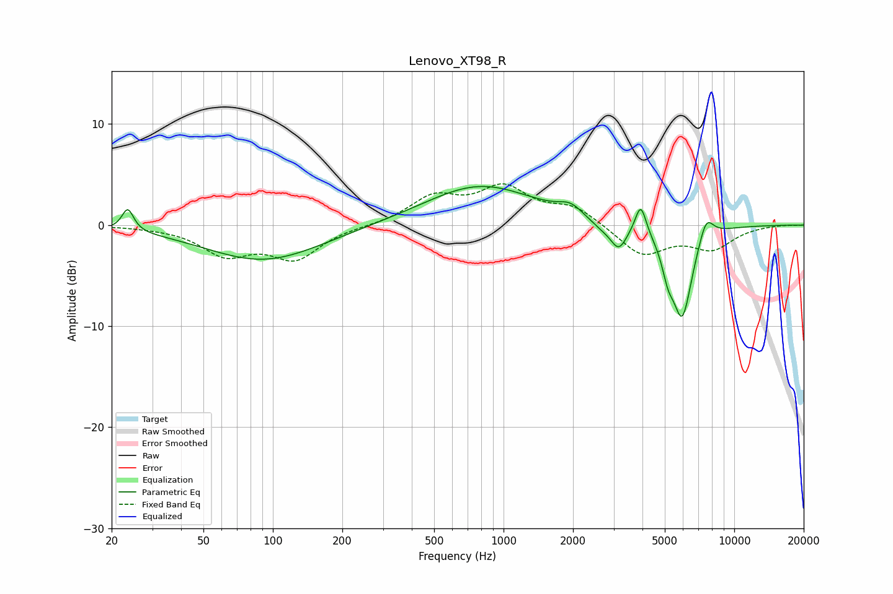

# Lenovo_XT98_R
See [usage instructions](https://github.com/jaakkopasanen/AutoEq#usage) for more options and info.

### Parametric EQs
Apply preamp of -3.9 dB when using parametric equalizer.

|   # | Type    |   Fc (Hz) |    Q |   Gain (dB) |
|-----|---------|-----------|------|-------------|
|   1 | Peaking |        23 | 5.71 |         2.2 |
|   2 | Peaking |        91 | 0.56 |        -3.5 |
|   3 | Peaking |       792 | 0.59 |         4   |
|   4 | Peaking |      1950 | 2.81 |         1   |
|   5 | Peaking |      2669 | 2.55 |        -0.7 |
|   6 | Peaking |      3159 | 3.99 |        -2.3 |
|   7 | Peaking |      3932 | 5.95 |         3   |
|   8 | Peaking |      5157 | 5.45 |        -2.3 |
|   9 | Peaking |      5948 | 3.07 |        -9   |
|  10 | Peaking |      7551 | 4.19 |         2.4 |

### Fixed Band EQs
When using fixed band (also called graphic) equalizer, apply preamp of **-4.2 dB** (if available) and set gains manually with these parameters.

|   # | Type    |   Fc (Hz) |    Q |   Gain (dB) |
|-----|---------|-----------|------|-------------|
|   1 | Peaking |        31 | 1.41 |        -0.1 |
|   2 | Peaking |        62 | 1.41 |        -2.7 |
|   3 | Peaking |       125 | 1.41 |        -3.1 |
|   4 | Peaking |       250 | 1.41 |        -0.1 |
|   5 | Peaking |       500 | 1.41 |         2.6 |
|   6 | Peaking |      1000 | 1.41 |         3.4 |
|   7 | Peaking |      2000 | 1.41 |         1.7 |
|   8 | Peaking |      4000 | 1.41 |        -3   |
|   9 | Peaking |      8000 | 1.41 |        -2.2 |
|  10 | Peaking |     16000 | 1.41 |         0.1 |

### Graphs

