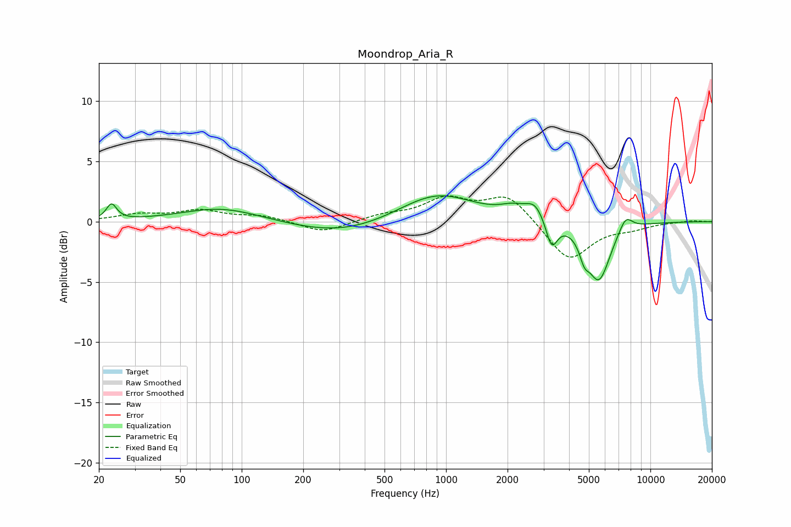

# Moondrop_Aria_R
See [usage instructions](https://github.com/jaakkopasanen/AutoEq#usage) for more options and info.

### Parametric EQs
Apply preamp of -2.2 dB when using parametric equalizer.

|   # | Type    |   Fc (Hz) |    Q |   Gain (dB) |
|-----|---------|-----------|------|-------------|
|   1 | Peaking |        23 | 5.81 |         1.3 |
|   2 | Peaking |        80 | 0.73 |         1.2 |
|   3 | Peaking |       311 | 0.58 |        -1.1 |
|   4 | Peaking |       898 | 0.76 |         2.4 |
|   5 | Peaking |      2117 | 2.24 |         0.7 |
|   6 | Peaking |      2726 | 2.98 |         1.3 |
|   7 | Peaking |      3287 | 5.01 |        -2.3 |
|   8 | Peaking |      4748 | 6    |        -1.3 |
|   9 | Peaking |      5594 | 2.45 |        -4.8 |
|  10 | Peaking |      7568 | 3.99 |         1.3 |

### Fixed Band EQs
When using fixed band (also called graphic) equalizer, apply preamp of **-2.2 dB** (if available) and set gains manually with these parameters.

|   # | Type    |   Fc (Hz) |    Q |   Gain (dB) |
|-----|---------|-----------|------|-------------|
|   1 | Peaking |        31 | 1.41 |         0.5 |
|   2 | Peaking |        62 | 1.41 |         0.9 |
|   3 | Peaking |       125 | 1.41 |         0.5 |
|   4 | Peaking |       250 | 1.41 |        -1   |
|   5 | Peaking |       500 | 1.41 |         0.5 |
|   6 | Peaking |      1000 | 1.41 |         1.8 |
|   7 | Peaking |      2000 | 1.41 |         2.2 |
|   8 | Peaking |      4000 | 1.41 |        -3.3 |
|   9 | Peaking |      8000 | 1.41 |        -0.4 |
|  10 | Peaking |     16000 | 1.41 |         0.1 |

### Graphs

