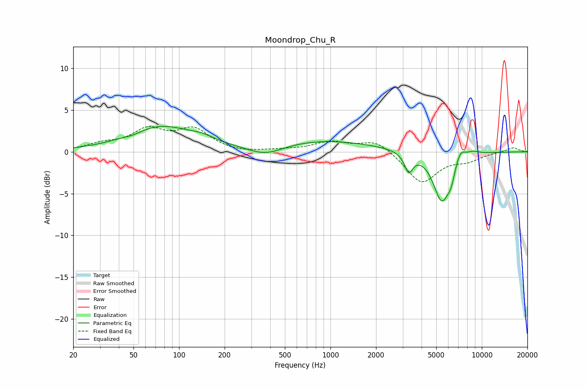

# Moondrop_Chu_R
See [usage instructions](https://github.com/jaakkopasanen/AutoEq#usage) for more options and info.

### Parametric EQs
Apply preamp of -3.1 dB when using parametric equalizer.

|   # | Type    |   Fc (Hz) |    Q |   Gain (dB) |
|-----|---------|-----------|------|-------------|
|   1 | Peaking |        50 | 2.86 |        -0.2 |
|   2 | Peaking |        76 | 0.65 |         3   |
|   3 | Peaking |       143 | 1.8  |         0.5 |
|   4 | Peaking |       372 | 1.17 |        -1.3 |
|   5 | Peaking |       861 | 0.39 |         1.4 |
|   6 | Peaking |      3289 | 5.02 |        -2.2 |
|   7 | Peaking |      5442 | 2.44 |        -5.9 |
|   8 | Peaking |      6266 | 6    |        -1.3 |
|   9 | Peaking |      7214 | 4.33 |         1.4 |
|  10 | Peaking |      8650 | 2.88 |         0.5 |

### Fixed Band EQs
When using fixed band (also called graphic) equalizer, apply preamp of **-3.1 dB** (if available) and set gains manually with these parameters.

|   # | Type    |   Fc (Hz) |    Q |   Gain (dB) |
|-----|---------|-----------|------|-------------|
|   1 | Peaking |        31 | 1.41 |         0.8 |
|   2 | Peaking |        62 | 1.41 |         2.4 |
|   3 | Peaking |       125 | 1.41 |         2.5 |
|   4 | Peaking |       250 | 1.41 |        -0.2 |
|   5 | Peaking |       500 | 1.41 |         0.2 |
|   6 | Peaking |      1000 | 1.41 |         1.1 |
|   7 | Peaking |      2000 | 1.41 |         1.4 |
|   8 | Peaking |      4000 | 1.41 |        -3.7 |
|   9 | Peaking |      8000 | 1.41 |        -0.9 |
|  10 | Peaking |     16000 | 1.41 |         0.5 |

### Graphs

