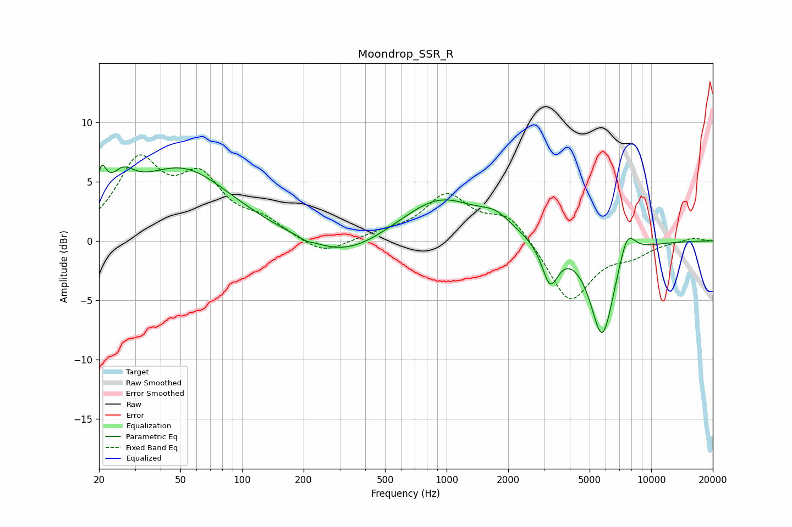

# Moondrop_SSR_R
See [usage instructions](https://github.com/jaakkopasanen/AutoEq#usage) for more options and info.

### Parametric EQs
Apply preamp of -6.5 dB when using parametric equalizer.

|   # | Type    |   Fc (Hz) |    Q |   Gain (dB) |
|-----|---------|-----------|------|-------------|
|   1 | Peaking |        21 | 5.98 |         2.7 |
|   2 | Peaking |        26 | 2.32 |         2.4 |
|   3 | Peaking |        51 | 0.58 |         6   |
|   4 | Peaking |       205 | 5.94 |        -0.2 |
|   5 | Peaking |       316 | 0.75 |        -1.8 |
|   6 | Peaking |       929 | 0.73 |         3.7 |
|   7 | Peaking |      1735 | 1.93 |         1.1 |
|   8 | Peaking |      3206 | 3.5  |        -3.5 |
|   9 | Peaking |      5768 | 2.31 |        -8.2 |
|  10 | Peaking |      7620 | 3.26 |         2.5 |

### Fixed Band EQs
When using fixed band (also called graphic) equalizer, apply preamp of **-7.3 dB** (if available) and set gains manually with these parameters.

|   # | Type    |   Fc (Hz) |    Q |   Gain (dB) |
|-----|---------|-----------|------|-------------|
|   1 | Peaking |        31 | 1.41 |         6.3 |
|   2 | Peaking |        62 | 1.41 |         4.6 |
|   3 | Peaking |       125 | 1.41 |         1.4 |
|   4 | Peaking |       250 | 1.41 |        -1.3 |
|   5 | Peaking |       500 | 1.41 |         0.5 |
|   6 | Peaking |      1000 | 1.41 |         3.7 |
|   7 | Peaking |      2000 | 1.41 |         2.2 |
|   8 | Peaking |      4000 | 1.41 |        -5.2 |
|   9 | Peaking |      8000 | 1.41 |        -1   |
|  10 | Peaking |     16000 | 1.41 |         0.3 |

### Graphs

