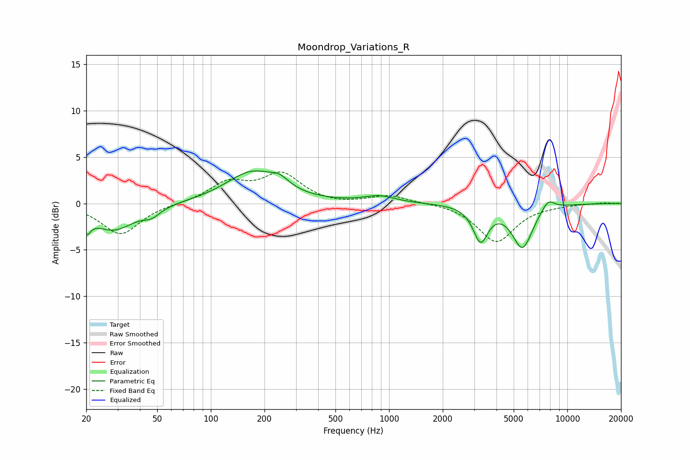

# Moondrop_Variations_R
See [usage instructions](https://github.com/jaakkopasanen/AutoEq#usage) for more options and info.

### Parametric EQs
Apply preamp of -3.6 dB when using parametric equalizer.

|   # | Type    |   Fc (Hz) |    Q |   Gain (dB) |
|-----|---------|-----------|------|-------------|
|   1 | Peaking |        20 | 5.87 |        -3.1 |
|   2 | Peaking |        20 | 5.99 |         1.3 |
|   3 | Peaking |        28 | 1.21 |        -2.8 |
|   4 | Peaking |        46 | 2.99 |        -0.8 |
|   5 | Peaking |       172 | 0.96 |         3.4 |
|   6 | Peaking |       244 | 2.79 |         0.9 |
|   7 | Peaking |       883 | 1.66 |         0.7 |
|   8 | Peaking |      3262 | 3.45 |        -3.7 |
|   9 | Peaking |      5601 | 2.41 |        -4.7 |
|  10 | Peaking |      7795 | 3.62 |         1.2 |

### Fixed Band EQs
When using fixed band (also called graphic) equalizer, apply preamp of **-3.5 dB** (if available) and set gains manually with these parameters.

|   # | Type    |   Fc (Hz) |    Q |   Gain (dB) |
|-----|---------|-----------|------|-------------|
|   1 | Peaking |        31 | 1.41 |        -3.3 |
|   2 | Peaking |        62 | 1.41 |        -0   |
|   3 | Peaking |       125 | 1.41 |         2.1 |
|   4 | Peaking |       250 | 1.41 |         3   |
|   5 | Peaking |       500 | 1.41 |        -0.2 |
|   6 | Peaking |      1000 | 1.41 |         0.9 |
|   7 | Peaking |      2000 | 1.41 |         0.1 |
|   8 | Peaking |      4000 | 1.41 |        -4.1 |
|   9 | Peaking |      8000 | 1.41 |        -0.1 |
|  10 | Peaking |     16000 | 1.41 |         0.1 |

### Graphs

