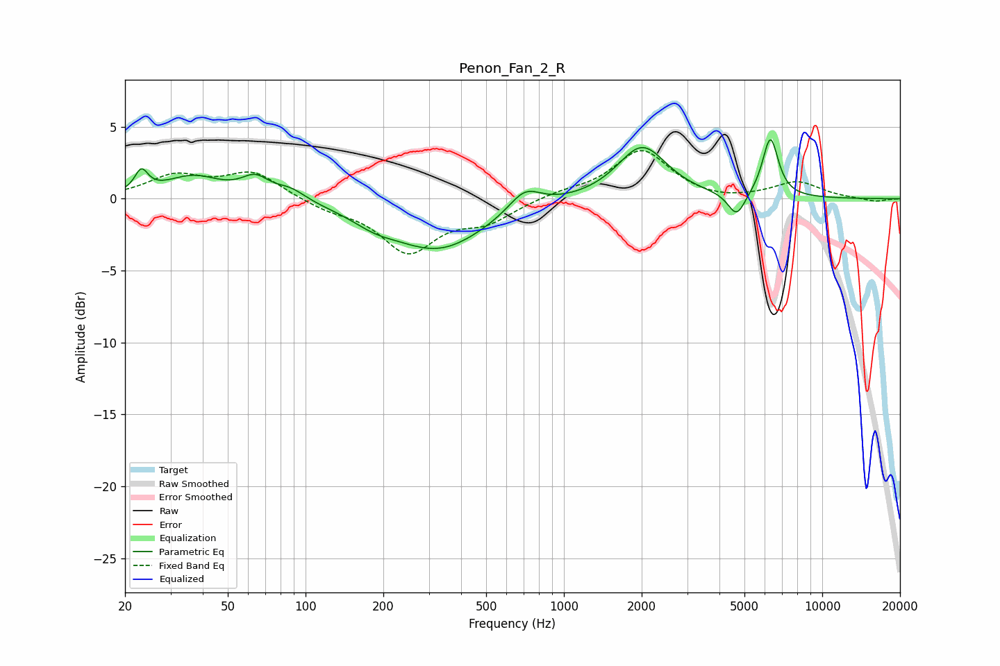

# Penon_Fan_2_R
See [usage instructions](https://github.com/jaakkopasanen/AutoEq#usage) for more options and info.

### Parametric EQs
Apply preamp of -4.2 dB when using parametric equalizer.

|   # | Type    |   Fc (Hz) |    Q |   Gain (dB) |
|-----|---------|-----------|------|-------------|
|   1 | Peaking |        23 | 5.67 |         1.5 |
|   2 | Peaking |        37 | 1.29 |         1.5 |
|   3 | Peaking |        64 | 2.65 |         1.3 |
|   4 | Peaking |        88 | 2.33 |         0.8 |
|   5 | Peaking |       184 | 1.69 |        -0.6 |
|   6 | Peaking |       326 | 0.75 |        -3.5 |
|   7 | Peaking |       705 | 2.27 |         1.5 |
|   8 | Peaking |      2009 | 1.49 |         3.7 |
|   9 | Peaking |      4664 | 4.16 |        -1.7 |
|  10 | Peaking |      6298 | 4.48 |         4.1 |

### Fixed Band EQs
When using fixed band (also called graphic) equalizer, apply preamp of **-3.4 dB** (if available) and set gains manually with these parameters.

|   # | Type    |   Fc (Hz) |    Q |   Gain (dB) |
|-----|---------|-----------|------|-------------|
|   1 | Peaking |        31 | 1.41 |         1.5 |
|   2 | Peaking |        62 | 1.41 |         1.8 |
|   3 | Peaking |       125 | 1.41 |        -0.6 |
|   4 | Peaking |       250 | 1.41 |        -3.6 |
|   5 | Peaking |       500 | 1.41 |        -1.4 |
|   6 | Peaking |      1000 | 1.41 |         0.4 |
|   7 | Peaking |      2000 | 1.41 |         3.4 |
|   8 | Peaking |      4000 | 1.41 |        -0.3 |
|   9 | Peaking |      8000 | 1.41 |         1.1 |
|  10 | Peaking |     16000 | 1.41 |        -0.2 |

### Graphs

