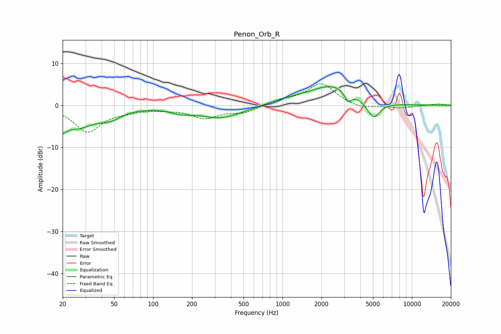

# Penon_Orb_R
See [usage instructions](https://github.com/jaakkopasanen/AutoEq#usage) for more options and info.

### Parametric EQs
Apply preamp of -4.5 dB when using parametric equalizer.

|   # | Type    |   Fc (Hz) |    Q |   Gain (dB) |
|-----|---------|-----------|------|-------------|
|   1 | Peaking |        20 | 5.54 |        -5.4 |
|   2 | Peaking |        20 | 5.98 |         3.1 |
|   3 | Peaking |        25 | 0.93 |        -5.1 |
|   4 | Peaking |        47 | 1.76 |        -1.7 |
|   5 | Peaking |       163 | 1.78 |        -0.9 |
|   6 | Peaking |       336 | 0.79 |        -3   |
|   7 | Peaking |      1171 | 0.74 |         1.2 |
|   8 | Peaking |      2435 | 0.89 |         4.3 |
|   9 | Peaking |      3208 | 5.67 |        -2.3 |
|  10 | Peaking |      5046 | 2.89 |        -4.1 |

### Fixed Band EQs
When using fixed band (also called graphic) equalizer, apply preamp of **-5.2 dB** (if available) and set gains manually with these parameters.

|   # | Type    |   Fc (Hz) |    Q |   Gain (dB) |
|-----|---------|-----------|------|-------------|
|   1 | Peaking |        31 | 1.41 |        -6.2 |
|   2 | Peaking |        62 | 1.41 |        -1   |
|   3 | Peaking |       125 | 1.41 |        -0.6 |
|   4 | Peaking |       250 | 1.41 |        -2.8 |
|   5 | Peaking |       500 | 1.41 |        -1.6 |
|   6 | Peaking |      1000 | 1.41 |         1.1 |
|   7 | Peaking |      2000 | 1.41 |         5.2 |
|   8 | Peaking |      4000 | 1.41 |        -1   |
|   9 | Peaking |      8000 | 1.41 |        -0.6 |
|  10 | Peaking |     16000 | 1.41 |         0.4 |

### Graphs

