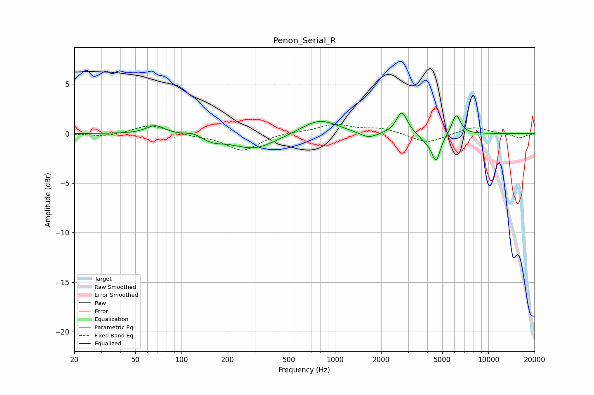

# Penon_Serial_R
See [usage instructions](https://github.com/jaakkopasanen/AutoEq#usage) for more options and info.

### Parametric EQs
Apply preamp of -2.2 dB when using parametric equalizer.

|   # | Type    |   Fc (Hz) |    Q |   Gain (dB) |
|-----|---------|-----------|------|-------------|
|   1 | Peaking |        68 | 2.43 |         0.9 |
|   2 | Peaking |       118 | 2.92 |         0.3 |
|   3 | Peaking |       159 | 2.06 |        -0.5 |
|   4 | Peaking |       298 | 0.98 |        -1.6 |
|   5 | Peaking |       791 | 1.2  |         1.5 |
|   6 | Peaking |      1653 | 2.39 |        -0.6 |
|   7 | Peaking |      2731 | 3.99 |         2.2 |
|   8 | Peaking |      3897 | 2.94 |        -0.6 |
|   9 | Peaking |      4559 | 4.82 |        -2.7 |
|  10 | Peaking |      6166 | 4.81 |         2   |

### Fixed Band EQs
When using fixed band (also called graphic) equalizer, apply preamp of **-1.0 dB** (if available) and set gains manually with these parameters.

|   # | Type    |   Fc (Hz) |    Q |   Gain (dB) |
|-----|---------|-----------|------|-------------|
|   1 | Peaking |        31 | 1.41 |        -0.3 |
|   2 | Peaking |        62 | 1.41 |         0.9 |
|   3 | Peaking |       125 | 1.41 |        -0.2 |
|   4 | Peaking |       250 | 1.41 |        -1.7 |
|   5 | Peaking |       500 | 1.41 |         0.2 |
|   6 | Peaking |      1000 | 1.41 |         0.9 |
|   7 | Peaking |      2000 | 1.41 |         0.5 |
|   8 | Peaking |      4000 | 1.41 |        -1   |
|   9 | Peaking |      8000 | 1.41 |         0.7 |
|  10 | Peaking |     16000 | 1.41 |        -0.5 |

### Graphs

