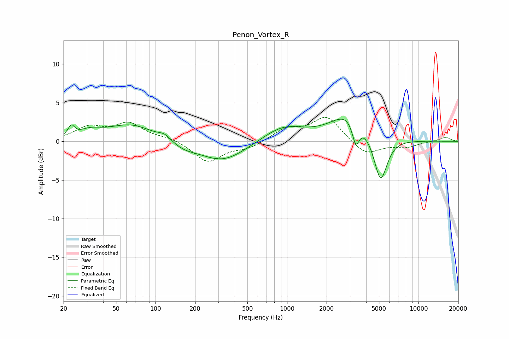

# Penon_Vortex_R
See [usage instructions](https://github.com/jaakkopasanen/AutoEq#usage) for more options and info.

### Parametric EQs
Apply preamp of -3.0 dB when using parametric equalizer.

|   # | Type    |   Fc (Hz) |    Q |   Gain (dB) |
|-----|---------|-----------|------|-------------|
|   1 | Peaking |        23 | 5.83 |         1.3 |
|   2 | Peaking |        32 | 1.74 |         0.9 |
|   3 | Peaking |        65 | 0.78 |         2.2 |
|   4 | Peaking |       117 | 3.24 |         0.6 |
|   5 | Peaking |       163 | 1.58 |        -0.7 |
|   6 | Peaking |       324 | 0.78 |        -2.7 |
|   7 | Peaking |       933 | 0.89 |         2   |
|   8 | Peaking |      2989 | 1.02 |         3.6 |
|   9 | Peaking |      3334 | 5.05 |        -3.1 |
|  10 | Peaking |      5144 | 2.71 |        -6.1 |

### Fixed Band EQs
When using fixed band (also called graphic) equalizer, apply preamp of **-3.2 dB** (if available) and set gains manually with these parameters.

|   # | Type    |   Fc (Hz) |    Q |   Gain (dB) |
|-----|---------|-----------|------|-------------|
|   1 | Peaking |        31 | 1.41 |         1.7 |
|   2 | Peaking |        62 | 1.41 |         2.2 |
|   3 | Peaking |       125 | 1.41 |         0.5 |
|   4 | Peaking |       250 | 1.41 |        -2.7 |
|   5 | Peaking |       500 | 1.41 |        -0.8 |
|   6 | Peaking |      1000 | 1.41 |         1.5 |
|   7 | Peaking |      2000 | 1.41 |         3.2 |
|   8 | Peaking |      4000 | 1.41 |        -1.8 |
|   9 | Peaking |      8000 | 1.41 |        -0.7 |
|  10 | Peaking |     16000 | 1.41 |         0.6 |

### Graphs

