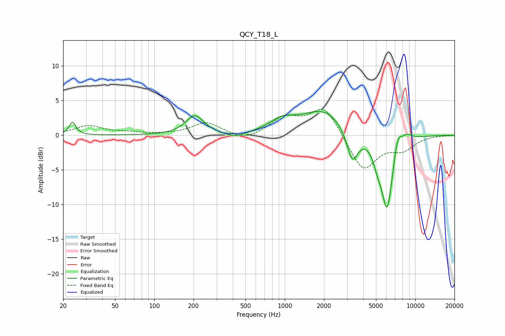

# QCY_T18_L
See [usage instructions](https://github.com/jaakkopasanen/AutoEq#usage) for more options and info.

### Parametric EQs
Apply preamp of -3.5 dB when using parametric equalizer.

|   # | Type    |   Fc (Hz) |    Q |   Gain (dB) |
|-----|---------|-----------|------|-------------|
|   1 | Peaking |        24 | 5.69 |         1.9 |
|   2 | Peaking |       205 | 2.06 |         2.8 |
|   3 | Peaking |       420 | 1.83 |        -0.7 |
|   4 | Peaking |       951 | 1.43 |         1.6 |
|   5 | Peaking |      1995 | 0.86 |         3.6 |
|   6 | Peaking |      3297 | 3.23 |        -4.6 |
|   7 | Peaking |      5128 | 4.47 |        -1.6 |
|   8 | Peaking |      6089 | 2.89 |       -11   |
|   9 | Peaking |      7341 | 4.37 |         3   |
|  10 | Peaking |      8609 | 3.19 |         1.1 |

### Fixed Band EQs
When using fixed band (also called graphic) equalizer, apply preamp of **-3.8 dB** (if available) and set gains manually with these parameters.

|   # | Type    |   Fc (Hz) |    Q |   Gain (dB) |
|-----|---------|-----------|------|-------------|
|   1 | Peaking |        31 | 1.41 |         1.3 |
|   2 | Peaking |        62 | 1.41 |         0.3 |
|   3 | Peaking |       125 | 1.41 |         0.1 |
|   4 | Peaking |       250 | 1.41 |         1.8 |
|   5 | Peaking |       500 | 1.41 |        -0.9 |
|   6 | Peaking |      1000 | 1.41 |         2.4 |
|   7 | Peaking |      2000 | 1.41 |         4.2 |
|   8 | Peaking |      4000 | 1.41 |        -5.2 |
|   9 | Peaking |      8000 | 1.41 |        -1.8 |
|  10 | Peaking |     16000 | 1.41 |        -0   |

### Graphs

