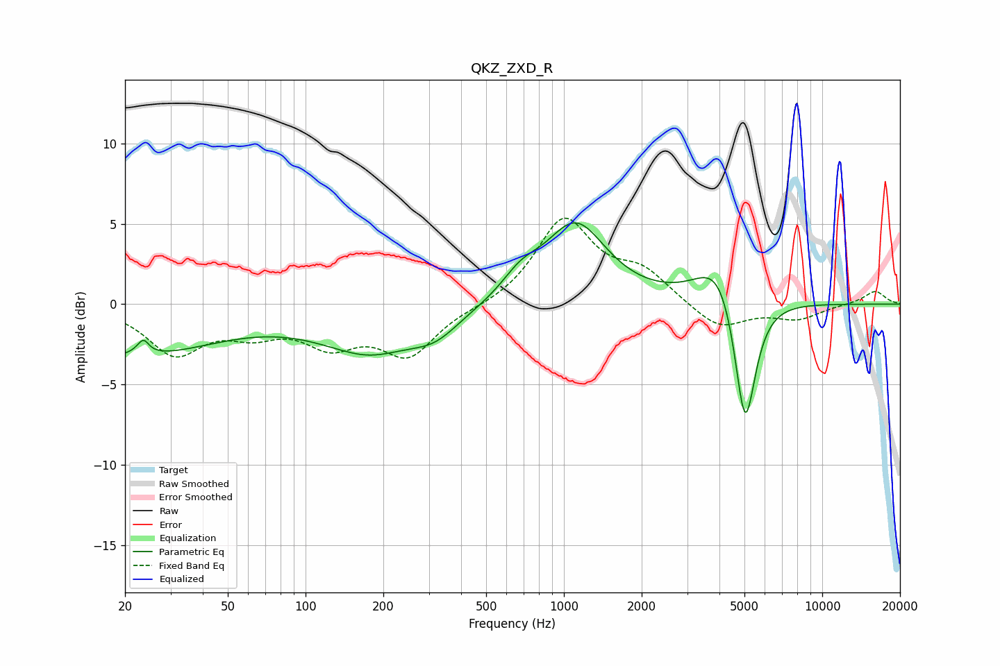

# QKZ_ZXD_R
See [usage instructions](https://github.com/jaakkopasanen/AutoEq#usage) for more options and info.

### Parametric EQs
Apply preamp of -5.2 dB when using parametric equalizer.

|   # | Type    |   Fc (Hz) |    Q |   Gain (dB) |
|-----|---------|-----------|------|-------------|
|   1 | Peaking |        20 | 0.41 |        -3.2 |
|   2 | Peaking |        24 | 5.5  |         2.9 |
|   3 | Peaking |        24 | 5.65 |        -2   |
|   4 | Peaking |       177 | 1.6  |        -0.2 |
|   5 | Peaking |       177 | 0.69 |        -2.6 |
|   6 | Peaking |       317 | 1.52 |        -1.2 |
|   7 | Peaking |       680 | 1.93 |         1.3 |
|   8 | Peaking |      1109 | 1.19 |         4.9 |
|   9 | Peaking |      4026 | 1.58 |         3.1 |
|  10 | Peaking |      5025 | 3.31 |        -8.9 |

### Fixed Band EQs
When using fixed band (also called graphic) equalizer, apply preamp of **-5.4 dB** (if available) and set gains manually with these parameters.

|   # | Type    |   Fc (Hz) |    Q |   Gain (dB) |
|-----|---------|-----------|------|-------------|
|   1 | Peaking |        31 | 1.41 |        -2.9 |
|   2 | Peaking |        62 | 1.41 |        -1.4 |
|   3 | Peaking |       125 | 1.41 |        -2.2 |
|   4 | Peaking |       250 | 1.41 |        -3   |
|   5 | Peaking |       500 | 1.41 |        -0.2 |
|   6 | Peaking |      1000 | 1.41 |         5.2 |
|   7 | Peaking |      2000 | 1.41 |         1.8 |
|   8 | Peaking |      4000 | 1.41 |        -1.6 |
|   9 | Peaking |      8000 | 1.41 |        -0.9 |
|  10 | Peaking |     16000 | 1.41 |         0.8 |

### Graphs

