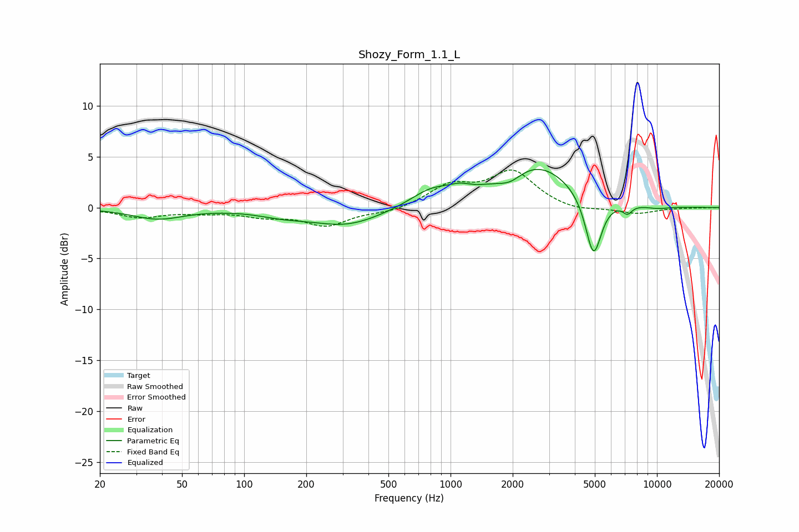

# Shozy_Form_1.1_L
See [usage instructions](https://github.com/jaakkopasanen/AutoEq#usage) for more options and info.

### Parametric EQs
Apply preamp of -3.8 dB when using parametric equalizer.

|   # | Type    |   Fc (Hz) |    Q |   Gain (dB) |
|-----|---------|-----------|------|-------------|
|   1 | Peaking |        38 | 1.12 |        -1.1 |
|   2 | Peaking |       153 | 1.19 |        -0.5 |
|   3 | Peaking |       314 | 0.8  |        -1.7 |
|   4 | Peaking |       810 | 1.36 |         1.5 |
|   5 | Peaking |      1109 | 2.84 |         0.5 |
|   6 | Peaking |      1944 | 2.33 |        -1   |
|   7 | Peaking |      2585 | 0.76 |         4.3 |
|   8 | Peaking |      4925 | 3.52 |        -6.1 |
|   9 | Peaking |      7198 | 6    |        -0.8 |
|  10 | Peaking |     10000 | 1.88 |        -0.3 |

### Fixed Band EQs
When using fixed band (also called graphic) equalizer, apply preamp of **-3.8 dB** (if available) and set gains manually with these parameters.

|   # | Type    |   Fc (Hz) |    Q |   Gain (dB) |
|-----|---------|-----------|------|-------------|
|   1 | Peaking |        31 | 1.41 |        -0.9 |
|   2 | Peaking |        62 | 1.41 |        -0.4 |
|   3 | Peaking |       125 | 1.41 |        -0.7 |
|   4 | Peaking |       250 | 1.41 |        -1.7 |
|   5 | Peaking |       500 | 1.41 |        -0.5 |
|   6 | Peaking |      1000 | 1.41 |         2   |
|   7 | Peaking |      2000 | 1.41 |         3.4 |
|   8 | Peaking |      4000 | 1.41 |        -0.4 |
|   9 | Peaking |      8000 | 1.41 |        -0.6 |
|  10 | Peaking |     16000 | 1.41 |        -0   |

### Graphs

