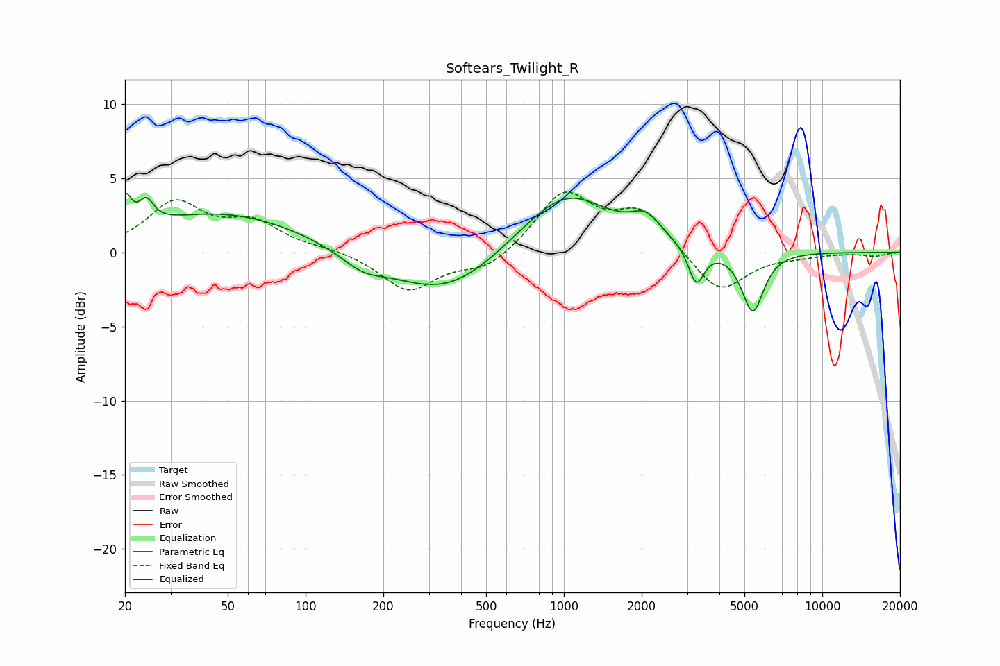

# Softears_Twilight_R
See [usage instructions](https://github.com/jaakkopasanen/AutoEq#usage) for more options and info.

### Parametric EQs
Apply preamp of -4.1 dB when using parametric equalizer.

|   # | Type    |   Fc (Hz) |    Q |   Gain (dB) |
|-----|---------|-----------|------|-------------|
|   1 | Peaking |        20 | 6    |         2.2 |
|   2 | Peaking |        24 | 5    |         1.5 |
|   3 | Peaking |        48 | 0.44 |         2.7 |
|   4 | Peaking |       166 | 1.73 |        -0.9 |
|   5 | Peaking |       350 | 0.65 |        -3.2 |
|   6 | Peaking |       986 | 0.72 |         3.8 |
|   7 | Peaking |      1059 | 1.32 |         0.6 |
|   8 | Peaking |      2084 | 2.47 |         1.4 |
|   9 | Peaking |      3254 | 4.64 |        -2.6 |
|  10 | Peaking |      5385 | 3.31 |        -4.1 |

### Fixed Band EQs
When using fixed band (also called graphic) equalizer, apply preamp of **-4.2 dB** (if available) and set gains manually with these parameters.

|   # | Type    |   Fc (Hz) |    Q |   Gain (dB) |
|-----|---------|-----------|------|-------------|
|   1 | Peaking |        31 | 1.41 |         3.2 |
|   2 | Peaking |        62 | 1.41 |         1.8 |
|   3 | Peaking |       125 | 1.41 |         0.2 |
|   4 | Peaking |       250 | 1.41 |        -2.6 |
|   5 | Peaking |       500 | 1.41 |        -1.2 |
|   6 | Peaking |      1000 | 1.41 |         3.9 |
|   7 | Peaking |      2000 | 1.41 |         2.7 |
|   8 | Peaking |      4000 | 1.41 |        -2.9 |
|   9 | Peaking |      8000 | 1.41 |        -0.2 |
|  10 | Peaking |     16000 | 1.41 |        -0.2 |

### Graphs

