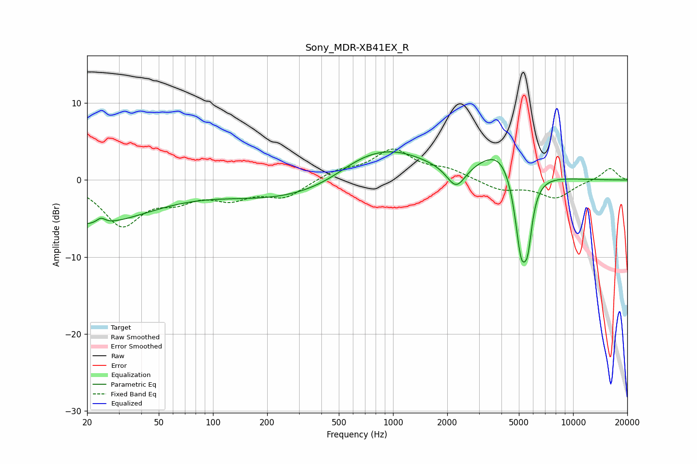

# Sony_MDR-XB41EX_R
See [usage instructions](https://github.com/jaakkopasanen/AutoEq#usage) for more options and info.

### Parametric EQs
Apply preamp of -3.8 dB when using parametric equalizer.

|   # | Type    |   Fc (Hz) |    Q |   Gain (dB) |
|-----|---------|-----------|------|-------------|
|   1 | Peaking |        20 | 0.41 |        -5.7 |
|   2 | Peaking |        24 | 5.88 |         2.9 |
|   3 | Peaking |        24 | 5.89 |        -2.2 |
|   4 | Peaking |       261 | 0.39 |        -2.5 |
|   5 | Peaking |       642 | 1.03 |         1.1 |
|   6 | Peaking |       963 | 0.65 |         3.9 |
|   7 | Peaking |      2242 | 2.69 |        -3.1 |
|   8 | Peaking |      4086 | 1.14 |         4.5 |
|   9 | Peaking |      5145 | 3.59 |       -11.5 |
|  10 | Peaking |      5603 | 6    |        -5   |

### Fixed Band EQs
When using fixed band (also called graphic) equalizer, apply preamp of **-4.1 dB** (if available) and set gains manually with these parameters.

|   # | Type    |   Fc (Hz) |    Q |   Gain (dB) |
|-----|---------|-----------|------|-------------|
|   1 | Peaking |        31 | 1.41 |        -5.6 |
|   2 | Peaking |        62 | 1.41 |        -2   |
|   3 | Peaking |       125 | 1.41 |        -2   |
|   4 | Peaking |       250 | 1.41 |        -2.1 |
|   5 | Peaking |       500 | 1.41 |         1.1 |
|   6 | Peaking |      1000 | 1.41 |         3.8 |
|   7 | Peaking |      2000 | 1.41 |         1.2 |
|   8 | Peaking |      4000 | 1.41 |        -1.3 |
|   9 | Peaking |      8000 | 1.41 |        -2.3 |
|  10 | Peaking |     16000 | 1.41 |         1.6 |

### Graphs

