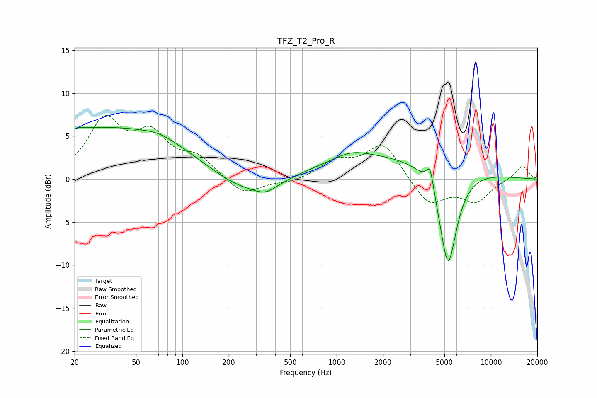

# TFZ_T2_Pro_R
See [usage instructions](https://github.com/jaakkopasanen/AutoEq#usage) for more options and info.

### Parametric EQs
Apply preamp of -6.1 dB when using parametric equalizer.

|   # | Type    |   Fc (Hz) |    Q |   Gain (dB) |
|-----|---------|-----------|------|-------------|
|   1 | Peaking |        23 | 5.85 |         3.1 |
|   2 | Peaking |        23 | 5.98 |        -3   |
|   3 | Peaking |        31 | 0.21 |         6   |
|   4 | Peaking |        71 | 1.29 |         0.6 |
|   5 | Peaking |       249 | 0.61 |        -2.6 |
|   6 | Peaking |       348 | 2.08 |        -0.9 |
|   7 | Peaking |      1245 | 1.27 |         0.9 |
|   8 | Peaking |      2306 | 0.27 |         2.8 |
|   9 | Peaking |      4037 | 5.85 |         2.7 |
|  10 | Peaking |      5277 | 2.36 |       -11.9 |

### Fixed Band EQs
When using fixed band (also called graphic) equalizer, apply preamp of **-7.5 dB** (if available) and set gains manually with these parameters.

|   # | Type    |   Fc (Hz) |    Q |   Gain (dB) |
|-----|---------|-----------|------|-------------|
|   1 | Peaking |        31 | 1.41 |         6.5 |
|   2 | Peaking |        62 | 1.41 |         4.5 |
|   3 | Peaking |       125 | 1.41 |         2.2 |
|   4 | Peaking |       250 | 1.41 |        -2   |
|   5 | Peaking |       500 | 1.41 |        -0.4 |
|   6 | Peaking |      1000 | 1.41 |         1.9 |
|   7 | Peaking |      2000 | 1.41 |         4.1 |
|   8 | Peaking |      4000 | 1.41 |        -3.1 |
|   9 | Peaking |      8000 | 1.41 |        -2.5 |
|  10 | Peaking |     16000 | 1.41 |         1.6 |

### Graphs

