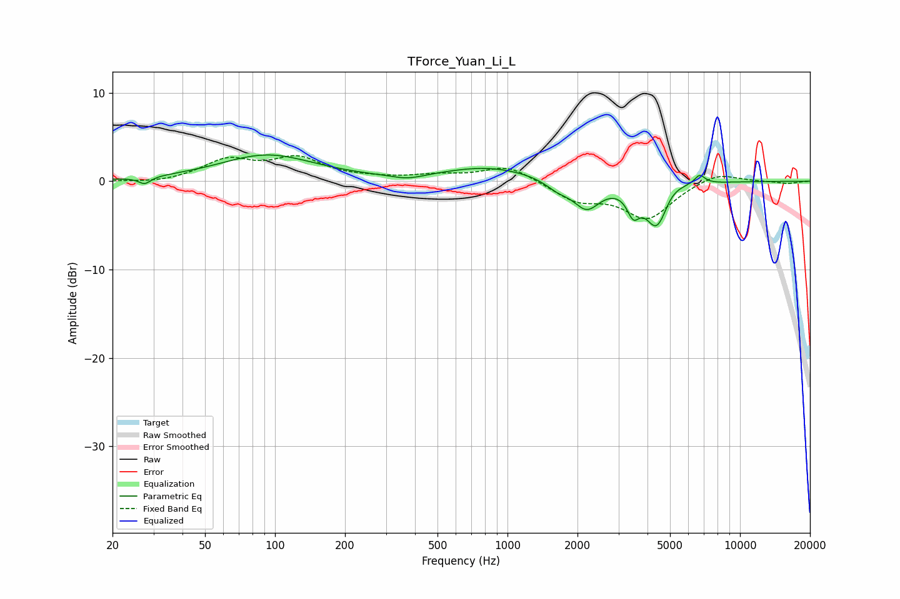

# TForce_Yuan_Li_L
See [usage instructions](https://github.com/jaakkopasanen/AutoEq#usage) for more options and info.

### Parametric EQs
Apply preamp of -3.1 dB when using parametric equalizer.

|   # | Type    |   Fc (Hz) |    Q |   Gain (dB) |
|-----|---------|-----------|------|-------------|
|   1 | Peaking |        28 | 5.49 |        -0.8 |
|   2 | Peaking |        93 | 0.69 |         2.9 |
|   3 | Peaking |       372 | 1.97 |        -0.6 |
|   4 | Peaking |       831 | 0.72 |         1.6 |
|   5 | Peaking |      1646 | 2.66 |        -1   |
|   6 | Peaking |      2190 | 2.46 |        -3   |
|   7 | Peaking |      3475 | 5.3  |        -2.5 |
|   8 | Peaking |      4406 | 2.77 |        -5.6 |
|   9 | Peaking |      4950 | 2.5  |         1.5 |
|  10 | Peaking |      6707 | 5.95 |         1.1 |

### Fixed Band EQs
When using fixed band (also called graphic) equalizer, apply preamp of **-3.0 dB** (if available) and set gains manually with these parameters.

|   # | Type    |   Fc (Hz) |    Q |   Gain (dB) |
|-----|---------|-----------|------|-------------|
|   1 | Peaking |        31 | 1.41 |        -0.3 |
|   2 | Peaking |        62 | 1.41 |         2.3 |
|   3 | Peaking |       125 | 1.41 |         2.4 |
|   4 | Peaking |       250 | 1.41 |         0.2 |
|   5 | Peaking |       500 | 1.41 |         0.6 |
|   6 | Peaking |      1000 | 1.41 |         1.8 |
|   7 | Peaking |      2000 | 1.41 |        -2.1 |
|   8 | Peaking |      4000 | 1.41 |        -4.1 |
|   9 | Peaking |      8000 | 1.41 |         1.1 |
|  10 | Peaking |     16000 | 1.41 |        -0.3 |

### Graphs

