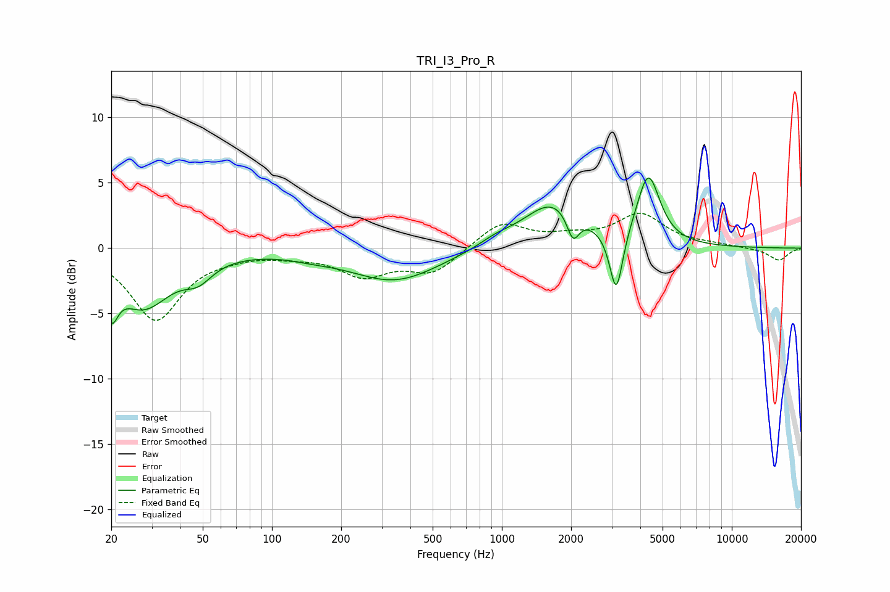

# TRI_I3_Pro_R
See [usage instructions](https://github.com/jaakkopasanen/AutoEq#usage) for more options and info.

### Parametric EQs
Apply preamp of -5.5 dB when using parametric equalizer.

|   # | Type    |   Fc (Hz) |    Q |   Gain (dB) |
|-----|---------|-----------|------|-------------|
|   1 | Peaking |        20 | 5.2  |        -2.9 |
|   2 | Peaking |        28 | 1.18 |        -4.3 |
|   3 | Peaking |        48 | 2.29 |        -1.3 |
|   4 | Peaking |       150 | 1.5  |        -0.2 |
|   5 | Peaking |       342 | 0.73 |        -2.5 |
|   6 | Peaking |       940 | 1.96 |         0.5 |
|   7 | Peaking |      1680 | 1.09 |         3.6 |
|   8 | Peaking |      2039 | 5.15 |        -2.1 |
|   9 | Peaking |      3144 | 4.95 |        -4.9 |
|  10 | Peaking |      4336 | 2.83 |         5.3 |

### Fixed Band EQs
When using fixed band (also called graphic) equalizer, apply preamp of **-2.8 dB** (if available) and set gains manually with these parameters.

|   # | Type    |   Fc (Hz) |    Q |   Gain (dB) |
|-----|---------|-----------|------|-------------|
|   1 | Peaking |        31 | 1.41 |        -5.4 |
|   2 | Peaking |        62 | 1.41 |        -0.3 |
|   3 | Peaking |       125 | 1.41 |        -0.4 |
|   4 | Peaking |       250 | 1.41 |        -1.9 |
|   5 | Peaking |       500 | 1.41 |        -1.8 |
|   6 | Peaking |      1000 | 1.41 |         2   |
|   7 | Peaking |      2000 | 1.41 |         0.7 |
|   8 | Peaking |      4000 | 1.41 |         2.5 |
|   9 | Peaking |      8000 | 1.41 |         0.2 |
|  10 | Peaking |     16000 | 1.41 |        -0.9 |

### Graphs

