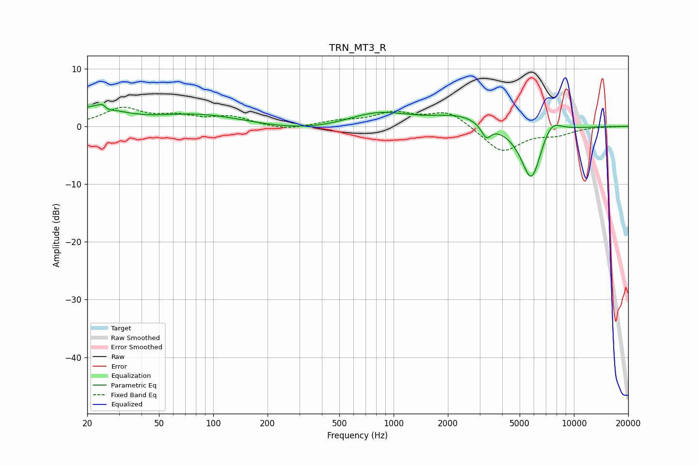

# TRN_MT3_R
See [usage instructions](https://github.com/jaakkopasanen/AutoEq#usage) for more options and info.

### Parametric EQs
Apply preamp of -3.9 dB when using parametric equalizer.

|   # | Type    |   Fc (Hz) |    Q |   Gain (dB) |
|-----|---------|-----------|------|-------------|
|   1 | Peaking |        22 | 1.1  |         3.1 |
|   2 | Peaking |        25 | 6    |         2.9 |
|   3 | Peaking |        25 | 5.45 |        -2.7 |
|   4 | Peaking |        85 | 0.57 |         2.1 |
|   5 | Peaking |       357 | 0.5  |        -1.1 |
|   6 | Peaking |       810 | 0.78 |         2.7 |
|   7 | Peaking |      2304 | 1.01 |         1.8 |
|   8 | Peaking |      3264 | 5.36 |        -2.3 |
|   9 | Peaking |      5812 | 2.3  |       -10   |
|  10 | Peaking |      7428 | 2.33 |         3.1 |

### Fixed Band EQs
When using fixed band (also called graphic) equalizer, apply preamp of **-3.4 dB** (if available) and set gains manually with these parameters.

|   # | Type    |   Fc (Hz) |    Q |   Gain (dB) |
|-----|---------|-----------|------|-------------|
|   1 | Peaking |        31 | 1.41 |         3   |
|   2 | Peaking |        62 | 1.41 |         1.5 |
|   3 | Peaking |       125 | 1.41 |         1.5 |
|   4 | Peaking |       250 | 1.41 |        -0.7 |
|   5 | Peaking |       500 | 1.41 |         0.8 |
|   6 | Peaking |      1000 | 1.41 |         2.1 |
|   7 | Peaking |      2000 | 1.41 |         2.6 |
|   8 | Peaking |      4000 | 1.41 |        -4.5 |
|   9 | Peaking |      8000 | 1.41 |        -1.2 |
|  10 | Peaking |     16000 | 1.41 |         0   |

### Graphs

