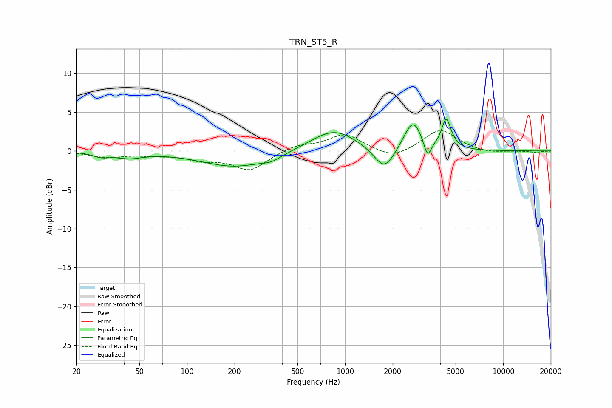

# TRN_ST5_R
See [usage instructions](https://github.com/jaakkopasanen/AutoEq#usage) for more options and info.

### Parametric EQs
Apply preamp of -4.2 dB when using parametric equalizer.

|   # | Type    |   Fc (Hz) |    Q |   Gain (dB) |
|-----|---------|-----------|------|-------------|
|   1 | Peaking |        29 | 2.77 |        -0.5 |
|   2 | Peaking |        43 | 1.64 |        -0.7 |
|   3 | Peaking |       203 | 0.66 |        -2   |
|   4 | Peaking |       343 | 2.43 |        -0.6 |
|   5 | Peaking |       847 | 0.97 |         2.8 |
|   6 | Peaking |      1772 | 2.17 |        -3.1 |
|   7 | Peaking |      2685 | 2.51 |         3.9 |
|   8 | Peaking |      3322 | 5.99 |        -2.3 |
|   9 | Peaking |      4362 | 5.01 |         3.7 |
|  10 | Peaking |      4767 | 4.74 |         0.2 |

### Fixed Band EQs
When using fixed band (also called graphic) equalizer, apply preamp of **-2.7 dB** (if available) and set gains manually with these parameters.

|   # | Type    |   Fc (Hz) |    Q |   Gain (dB) |
|-----|---------|-----------|------|-------------|
|   1 | Peaking |        31 | 1.41 |        -0.8 |
|   2 | Peaking |        62 | 1.41 |        -0.4 |
|   3 | Peaking |       125 | 1.41 |        -1   |
|   4 | Peaking |       250 | 1.41 |        -2.4 |
|   5 | Peaking |       500 | 1.41 |         0.8 |
|   6 | Peaking |      1000 | 1.41 |         2.1 |
|   7 | Peaking |      2000 | 1.41 |        -1.1 |
|   8 | Peaking |      4000 | 1.41 |         2.8 |
|   9 | Peaking |      8000 | 1.41 |        -0.3 |
|  10 | Peaking |     16000 | 1.41 |        -0.2 |

### Graphs

