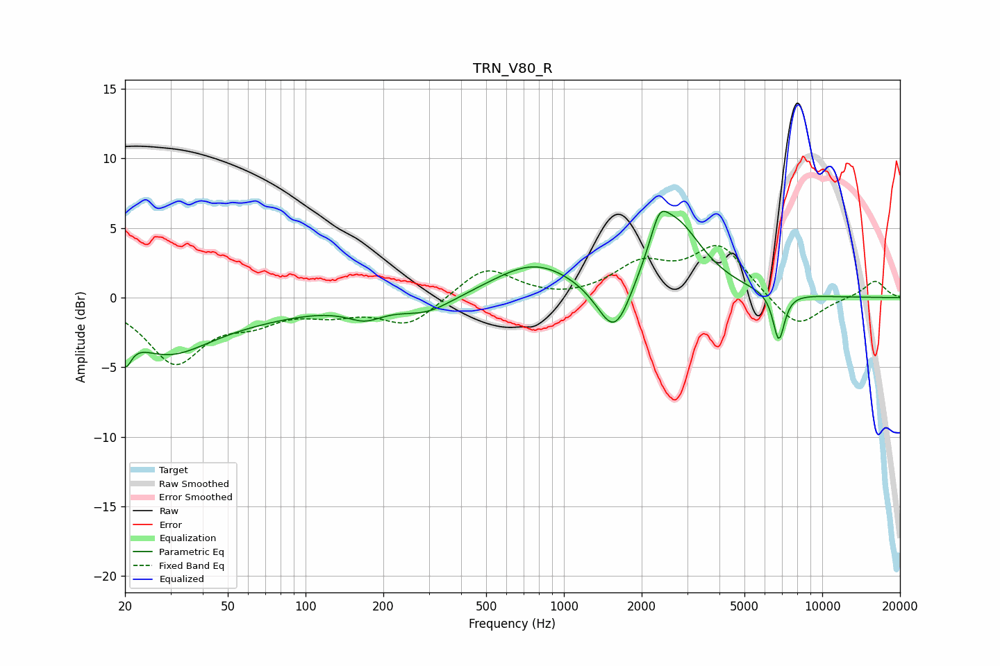

# TRN_V80_R
See [usage instructions](https://github.com/jaakkopasanen/AutoEq#usage) for more options and info.

### Parametric EQs
Apply preamp of -6.3 dB when using parametric equalizer.

|   # | Type    |   Fc (Hz) |    Q |   Gain (dB) |
|-----|---------|-----------|------|-------------|
|   1 | Peaking |        20 | 6    |        -2.2 |
|   2 | Peaking |        29 | 0.87 |        -3.3 |
|   3 | Peaking |        56 | 0.5  |        -1.1 |
|   4 | Peaking |       170 | 2    |        -1   |
|   5 | Peaking |       294 | 1.33 |        -1.1 |
|   6 | Peaking |       768 | 0.89 |         2.4 |
|   7 | Peaking |      1575 | 2.11 |        -4.3 |
|   8 | Peaking |      2339 | 4.35 |         2   |
|   9 | Peaking |      2677 | 1.34 |         5.4 |
|  10 | Peaking |      6789 | 6    |        -3.5 |

### Fixed Band EQs
When using fixed band (also called graphic) equalizer, apply preamp of **-3.8 dB** (if available) and set gains manually with these parameters.

|   # | Type    |   Fc (Hz) |    Q |   Gain (dB) |
|-----|---------|-----------|------|-------------|
|   1 | Peaking |        31 | 1.41 |        -4.5 |
|   2 | Peaking |        62 | 1.41 |        -1.3 |
|   3 | Peaking |       125 | 1.41 |        -0.9 |
|   4 | Peaking |       250 | 1.41 |        -2   |
|   5 | Peaking |       500 | 1.41 |         2.2 |
|   6 | Peaking |      1000 | 1.41 |        -0.2 |
|   7 | Peaking |      2000 | 1.41 |         2.2 |
|   8 | Peaking |      4000 | 1.41 |         3.6 |
|   9 | Peaking |      8000 | 1.41 |        -2.3 |
|  10 | Peaking |     16000 | 1.41 |         1.3 |

### Graphs

