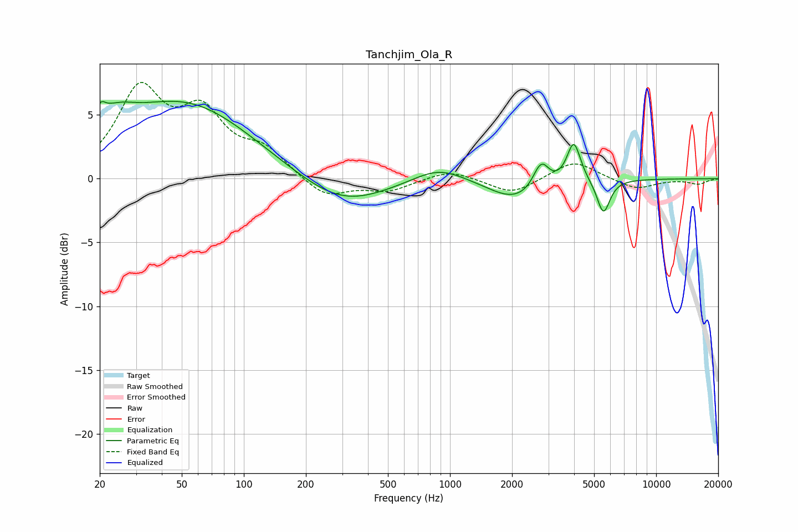

# Tanchjim_Ola_R
See [usage instructions](https://github.com/jaakkopasanen/AutoEq#usage) for more options and info.

### Parametric EQs
Apply preamp of -6.2 dB when using parametric equalizer.

|   # | Type    |   Fc (Hz) |    Q |   Gain (dB) |
|-----|---------|-----------|------|-------------|
|   1 | Peaking |        20 | 5.95 |         1.2 |
|   2 | Peaking |        23 | 1.39 |         2   |
|   3 | Peaking |        52 | 0.44 |         5.8 |
|   4 | Peaking |       299 | 0.67 |        -2.3 |
|   5 | Peaking |       880 | 1.13 |         1.2 |
|   6 | Peaking |      2070 | 1.1  |        -1.7 |
|   7 | Peaking |      2754 | 5.56 |        -1.3 |
|   8 | Peaking |      2759 | 4.41 |         3.3 |
|   9 | Peaking |      3985 | 4.29 |         3.2 |
|  10 | Peaking |      5551 | 4.44 |        -2.7 |

### Fixed Band EQs
When using fixed band (also called graphic) equalizer, apply preamp of **-7.6 dB** (if available) and set gains manually with these parameters.

|   # | Type    |   Fc (Hz) |    Q |   Gain (dB) |
|-----|---------|-----------|------|-------------|
|   1 | Peaking |        31 | 1.41 |         6.6 |
|   2 | Peaking |        62 | 1.41 |         4.5 |
|   3 | Peaking |       125 | 1.41 |         2   |
|   4 | Peaking |       250 | 1.41 |        -1.5 |
|   5 | Peaking |       500 | 1.41 |        -0.9 |
|   6 | Peaking |      1000 | 1.41 |         0.7 |
|   7 | Peaking |      2000 | 1.41 |        -1.2 |
|   8 | Peaking |      4000 | 1.41 |         1.5 |
|   9 | Peaking |      8000 | 1.41 |        -0.8 |
|  10 | Peaking |     16000 | 1.41 |        -0.4 |

### Graphs

