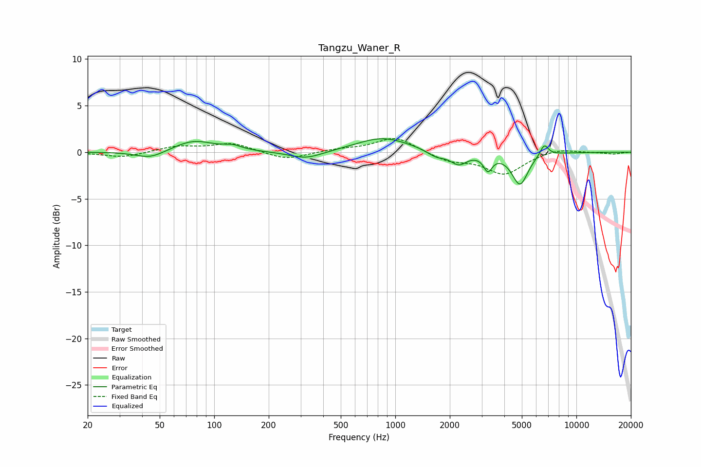

# Tangzu_Waner_R
See [usage instructions](https://github.com/jaakkopasanen/AutoEq#usage) for more options and info.

### Parametric EQs
Apply preamp of -1.5 dB when using parametric equalizer.

|   # | Type    |   Fc (Hz) |    Q |   Gain (dB) |
|-----|---------|-----------|------|-------------|
|   1 | Peaking |        44 | 1.77 |        -0.8 |
|   2 | Peaking |        77 | 1.28 |         1.3 |
|   3 | Peaking |       126 | 2.83 |         0.4 |
|   4 | Peaking |       322 | 1.52 |        -0.8 |
|   5 | Peaking |       854 | 0.97 |         1.6 |
|   6 | Peaking |      1681 | 2.83 |        -0.7 |
|   7 | Peaking |      2239 | 3.11 |        -1.3 |
|   8 | Peaking |      3246 | 5.96 |        -1.6 |
|   9 | Peaking |      4880 | 3.18 |        -3.4 |
|  10 | Peaking |      6642 | 5.9  |         1.3 |

### Fixed Band EQs
When using fixed band (also called graphic) equalizer, apply preamp of **-1.6 dB** (if available) and set gains manually with these parameters.

|   # | Type    |   Fc (Hz) |    Q |   Gain (dB) |
|-----|---------|-----------|------|-------------|
|   1 | Peaking |        31 | 1.41 |        -0.6 |
|   2 | Peaking |        62 | 1.41 |         0.6 |
|   3 | Peaking |       125 | 1.41 |         0.9 |
|   4 | Peaking |       250 | 1.41 |        -0.8 |
|   5 | Peaking |       500 | 1.41 |         0.3 |
|   6 | Peaking |      1000 | 1.41 |         1.7 |
|   7 | Peaking |      2000 | 1.41 |        -0.9 |
|   8 | Peaking |      4000 | 1.41 |        -2.3 |
|   9 | Peaking |      8000 | 1.41 |         0.5 |
|  10 | Peaking |     16000 | 1.41 |        -0.2 |

### Graphs

