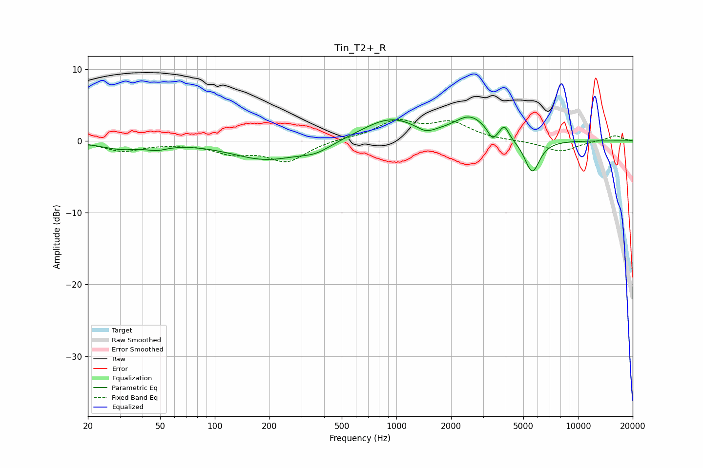

# Tin_T2+_R
See [usage instructions](https://github.com/jaakkopasanen/AutoEq#usage) for more options and info.

### Parametric EQs
Apply preamp of -3.4 dB when using parametric equalizer.

|   # | Type    |   Fc (Hz) |    Q |   Gain (dB) |
|-----|---------|-----------|------|-------------|
|   1 | Peaking |        30 | 1.29 |        -1   |
|   2 | Peaking |        48 | 2.45 |        -0.7 |
|   3 | Peaking |       192 | 0.74 |        -2.6 |
|   4 | Peaking |       360 | 1.62 |        -1.1 |
|   5 | Peaking |       925 | 0.9  |         3.1 |
|   6 | Peaking |      1451 | 2.77 |        -0.9 |
|   7 | Peaking |      2553 | 1.58 |         3   |
|   8 | Peaking |      3377 | 6    |        -1.4 |
|   9 | Peaking |      3937 | 6    |         1.7 |
|  10 | Peaking |      5591 | 3.32 |        -4.6 |

### Fixed Band EQs
When using fixed band (also called graphic) equalizer, apply preamp of **-3.1 dB** (if available) and set gains manually with these parameters.

|   # | Type    |   Fc (Hz) |    Q |   Gain (dB) |
|-----|---------|-----------|------|-------------|
|   1 | Peaking |        31 | 1.41 |        -1.4 |
|   2 | Peaking |        62 | 1.41 |        -0.2 |
|   3 | Peaking |       125 | 1.41 |        -1.5 |
|   4 | Peaking |       250 | 1.41 |        -2.8 |
|   5 | Peaking |       500 | 1.41 |         0.3 |
|   6 | Peaking |      1000 | 1.41 |         2.6 |
|   7 | Peaking |      2000 | 1.41 |         2.4 |
|   8 | Peaking |      4000 | 1.41 |        -0   |
|   9 | Peaking |      8000 | 1.41 |        -1.5 |
|  10 | Peaking |     16000 | 1.41 |         0.8 |

### Graphs

