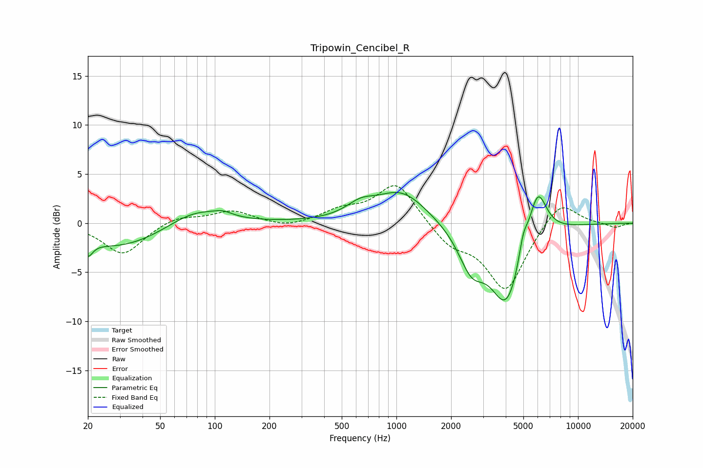

# Tripowin_Cencibel_R
See [usage instructions](https://github.com/jaakkopasanen/AutoEq#usage) for more options and info.

### Parametric EQs
Apply preamp of -3.2 dB when using parametric equalizer.

|   # | Type    |   Fc (Hz) |    Q |   Gain (dB) |
|-----|---------|-----------|------|-------------|
|   1 | Peaking |        20 | 5.53 |        -1.4 |
|   2 | Peaking |        30 | 0.56 |        -2.5 |
|   3 | Peaking |        78 | 0.91 |         1.9 |
|   4 | Peaking |       111 | 2.86 |         0.4 |
|   5 | Peaking |       633 | 1.83 |         1.2 |
|   6 | Peaking |      1066 | 1    |         3.3 |
|   7 | Peaking |      2587 | 1.97 |        -3.8 |
|   8 | Peaking |      4040 | 1.55 |        -8.2 |
|   9 | Peaking |      4989 | 5.84 |         2   |
|  10 | Peaking |      5981 | 2.68 |         5.4 |

### Fixed Band EQs
When using fixed band (also called graphic) equalizer, apply preamp of **-3.9 dB** (if available) and set gains manually with these parameters.

|   # | Type    |   Fc (Hz) |    Q |   Gain (dB) |
|-----|---------|-----------|------|-------------|
|   1 | Peaking |        31 | 1.41 |        -3.2 |
|   2 | Peaking |        62 | 1.41 |         0.8 |
|   3 | Peaking |       125 | 1.41 |         1.2 |
|   4 | Peaking |       250 | 1.41 |        -0.5 |
|   5 | Peaking |       500 | 1.41 |         1.2 |
|   6 | Peaking |      1000 | 1.41 |         4.2 |
|   7 | Peaking |      2000 | 1.41 |        -2.1 |
|   8 | Peaking |      4000 | 1.41 |        -6.8 |
|   9 | Peaking |      8000 | 1.41 |         2.6 |
|  10 | Peaking |     16000 | 1.41 |        -0.5 |

### Graphs

