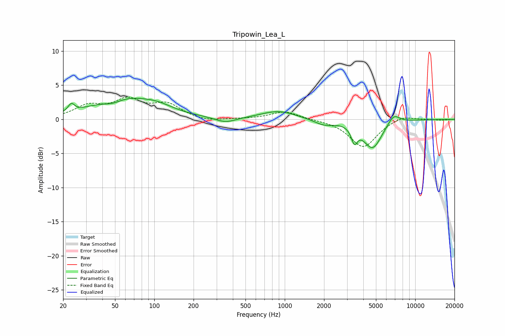

# Tripowin_Lea_L
See [usage instructions](https://github.com/jaakkopasanen/AutoEq#usage) for more options and info.

### Parametric EQs
Apply preamp of -3.2 dB when using parametric equalizer.

|   # | Type    |   Fc (Hz) |    Q |   Gain (dB) |
|-----|---------|-----------|------|-------------|
|   1 | Peaking |        23 | 5.96 |         1.1 |
|   2 | Peaking |        48 | 2.05 |        -0.7 |
|   3 | Peaking |        58 | 0.58 |         3.1 |
|   4 | Peaking |       106 | 1.27 |         0.7 |
|   5 | Peaking |       351 | 1.78 |        -0.8 |
|   6 | Peaking |       894 | 1.05 |         1.2 |
|   7 | Peaking |      2000 | 1.87 |        -0.8 |
|   8 | Peaking |      3416 | 5.97 |        -2.2 |
|   9 | Peaking |      4711 | 1.96 |        -4.2 |
|  10 | Peaking |      6831 | 3.01 |         1.5 |

### Fixed Band EQs
When using fixed band (also called graphic) equalizer, apply preamp of **-3.4 dB** (if available) and set gains manually with these parameters.

|   # | Type    |   Fc (Hz) |    Q |   Gain (dB) |
|-----|---------|-----------|------|-------------|
|   1 | Peaking |        31 | 1.41 |         1.8 |
|   2 | Peaking |        62 | 1.41 |         2.6 |
|   3 | Peaking |       125 | 1.41 |         2   |
|   4 | Peaking |       250 | 1.41 |        -0.4 |
|   5 | Peaking |       500 | 1.41 |         0   |
|   6 | Peaking |      1000 | 1.41 |         1.2 |
|   7 | Peaking |      2000 | 1.41 |        -0   |
|   8 | Peaking |      4000 | 1.41 |        -4.1 |
|   9 | Peaking |      8000 | 1.41 |         0.7 |
|  10 | Peaking |     16000 | 1.41 |        -0.1 |

### Graphs

