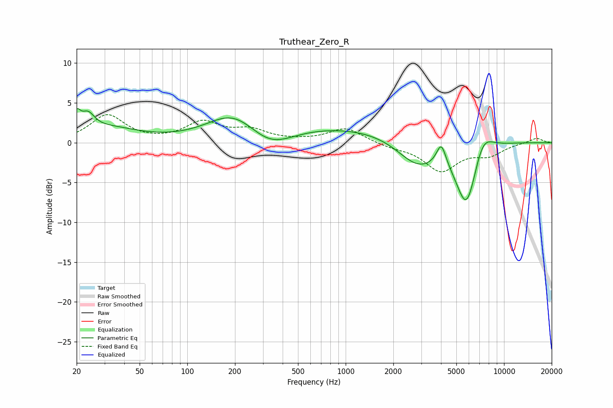

# Truthear_Zero_R
See [usage instructions](https://github.com/jaakkopasanen/AutoEq#usage) for more options and info.

### Parametric EQs
Apply preamp of -4.4 dB when using parametric equalizer.

|   # | Type    |   Fc (Hz) |    Q |   Gain (dB) |
|-----|---------|-----------|------|-------------|
|   1 | Peaking |        20 | 5.98 |         2.1 |
|   2 | Peaking |        24 | 3.42 |         2   |
|   3 | Peaking |        31 | 0.73 |         1.7 |
|   4 | Peaking |       195 | 0.89 |         3.2 |
|   5 | Peaking |       331 | 0.97 |        -2.7 |
|   6 | Peaking |      1153 | 0.18 |         2.2 |
|   7 | Peaking |      2864 | 1.02 |        -4   |
|   8 | Peaking |      4017 | 4.7  |         2.8 |
|   9 | Peaking |      5810 | 1.92 |        -8.9 |
|  10 | Peaking |      7280 | 2.06 |         3.3 |

### Fixed Band EQs
When using fixed band (also called graphic) equalizer, apply preamp of **-3.6 dB** (if available) and set gains manually with these parameters.

|   # | Type    |   Fc (Hz) |    Q |   Gain (dB) |
|-----|---------|-----------|------|-------------|
|   1 | Peaking |        31 | 1.41 |         3.4 |
|   2 | Peaking |        62 | 1.41 |         0.1 |
|   3 | Peaking |       125 | 1.41 |         2.4 |
|   4 | Peaking |       250 | 1.41 |         1.4 |
|   5 | Peaking |       500 | 1.41 |         0.1 |
|   6 | Peaking |      1000 | 1.41 |         1.8 |
|   7 | Peaking |      2000 | 1.41 |        -0.5 |
|   8 | Peaking |      4000 | 1.41 |        -3.4 |
|   9 | Peaking |      8000 | 1.41 |        -1.4 |
|  10 | Peaking |     16000 | 1.41 |         0.6 |

### Graphs

