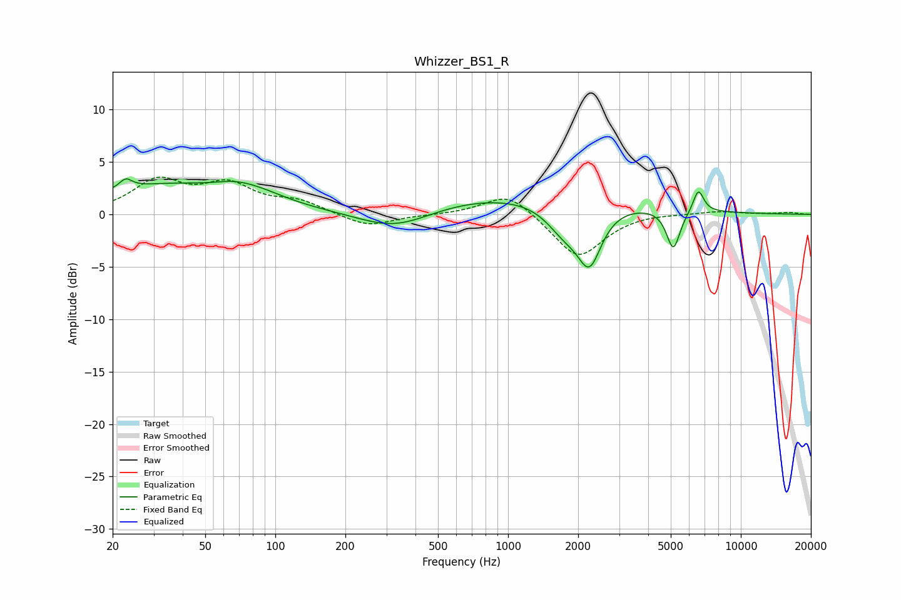

# Whizzer_BS1_R
See [usage instructions](https://github.com/jaakkopasanen/AutoEq#usage) for more options and info.

### Parametric EQs
Apply preamp of -3.5 dB when using parametric equalizer.

|   # | Type    |   Fc (Hz) |    Q |   Gain (dB) |
|-----|---------|-----------|------|-------------|
|   1 | Peaking |        23 | 5.3  |         0.9 |
|   2 | Peaking |        34 | 0.45 |         2.7 |
|   3 | Peaking |        66 | 1.77 |         0.5 |
|   4 | Peaking |        84 | 1.16 |         0.9 |
|   5 | Peaking |       328 | 0.85 |        -2.3 |
|   6 | Peaking |      1107 | 0.26 |         2.1 |
|   7 | Peaking |      1748 | 1.76 |        -2.6 |
|   8 | Peaking |      2239 | 2.72 |        -5.2 |
|   9 | Peaking |      5129 | 4.79 |        -3.8 |
|  10 | Peaking |      6573 | 6    |         2.2 |

### Fixed Band EQs
When using fixed band (also called graphic) equalizer, apply preamp of **-3.7 dB** (if available) and set gains manually with these parameters.

|   # | Type    |   Fc (Hz) |    Q |   Gain (dB) |
|-----|---------|-----------|------|-------------|
|   1 | Peaking |        31 | 1.41 |         3   |
|   2 | Peaking |        62 | 1.41 |         2.6 |
|   3 | Peaking |       125 | 1.41 |         1.1 |
|   4 | Peaking |       250 | 1.41 |        -1.2 |
|   5 | Peaking |       500 | 1.41 |        -0   |
|   6 | Peaking |      1000 | 1.41 |         2.2 |
|   7 | Peaking |      2000 | 1.41 |        -4.2 |
|   8 | Peaking |      4000 | 1.41 |         0.2 |
|   9 | Peaking |      8000 | 1.41 |         0.3 |
|  10 | Peaking |     16000 | 1.41 |         0.2 |

### Graphs

