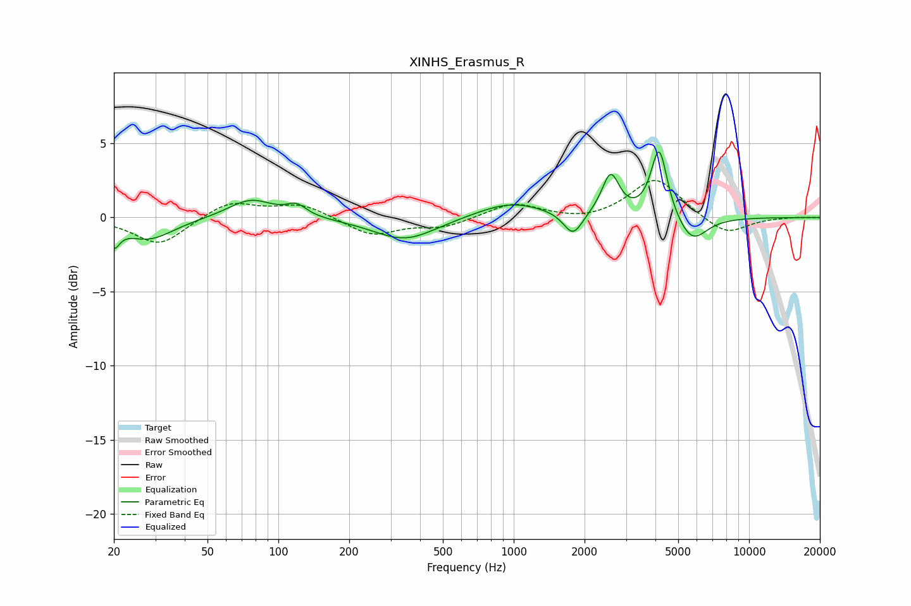

# XINHS_Erasmus_R
See [usage instructions](https://github.com/jaakkopasanen/AutoEq#usage) for more options and info.

### Parametric EQs
Apply preamp of -4.5 dB when using parametric equalizer.

|   # | Type    |   Fc (Hz) |    Q |   Gain (dB) |
|-----|---------|-----------|------|-------------|
|   1 | Peaking |        20 | 5.99 |        -1.3 |
|   2 | Peaking |        28 | 1.32 |        -1.5 |
|   3 | Peaking |        76 | 1.48 |         1.3 |
|   4 | Peaking |       120 | 3.38 |         0.7 |
|   5 | Peaking |       345 | 1.04 |        -1.6 |
|   6 | Peaking |       969 | 0.97 |         1.1 |
|   7 | Peaking |      1788 | 3.54 |        -1.6 |
|   8 | Peaking |      2580 | 3.88 |         2.8 |
|   9 | Peaking |      4149 | 4.08 |         4.8 |
|  10 | Peaking |      5719 | 2.21 |        -1.8 |

### Fixed Band EQs
When using fixed band (also called graphic) equalizer, apply preamp of **-2.6 dB** (if available) and set gains manually with these parameters.

|   # | Type    |   Fc (Hz) |    Q |   Gain (dB) |
|-----|---------|-----------|------|-------------|
|   1 | Peaking |        31 | 1.41 |        -1.9 |
|   2 | Peaking |        62 | 1.41 |         1.1 |
|   3 | Peaking |       125 | 1.41 |         0.9 |
|   4 | Peaking |       250 | 1.41 |        -1.2 |
|   5 | Peaking |       500 | 1.41 |        -0.6 |
|   6 | Peaking |      1000 | 1.41 |         1   |
|   7 | Peaking |      2000 | 1.41 |        -0.3 |
|   8 | Peaking |      4000 | 1.41 |         2.7 |
|   9 | Peaking |      8000 | 1.41 |        -1.2 |
|  10 | Peaking |     16000 | 1.41 |         0   |

### Graphs

