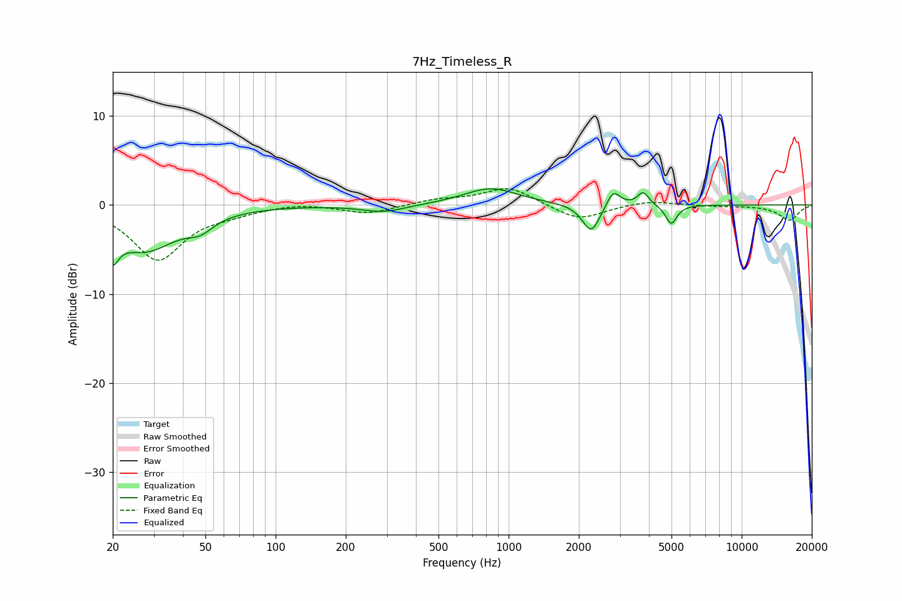

# 7Hz_Timeless_R
See [usage instructions](https://github.com/jaakkopasanen/AutoEq#usage) for more options and info.

### Parametric EQs
Apply preamp of -1.9 dB when using parametric equalizer.

|   # | Type    |   Fc (Hz) |    Q |   Gain (dB) |
|-----|---------|-----------|------|-------------|
|   1 | Peaking |        20 | 5.7  |        -5.6 |
|   2 | Peaking |        20 | 6    |         2.5 |
|   3 | Peaking |        27 | 1    |        -4.9 |
|   4 | Peaking |        47 | 2.58 |        -1.3 |
|   5 | Peaking |       292 | 1.52 |        -0.8 |
|   6 | Peaking |       838 | 1.24 |         1.9 |
|   7 | Peaking |      2263 | 3.77 |        -3.2 |
|   8 | Peaking |      2812 | 4.9  |         1.9 |
|   9 | Peaking |      3781 | 6    |         1.5 |
|  10 | Peaking |      4989 | 5.91 |        -2.2 |

### Fixed Band EQs
When using fixed band (also called graphic) equalizer, apply preamp of **-1.9 dB** (if available) and set gains manually with these parameters.

|   # | Type    |   Fc (Hz) |    Q |   Gain (dB) |
|-----|---------|-----------|------|-------------|
|   1 | Peaking |        31 | 1.41 |        -6.1 |
|   2 | Peaking |        62 | 1.41 |        -0.7 |
|   3 | Peaking |       125 | 1.41 |         0.3 |
|   4 | Peaking |       250 | 1.41 |        -1   |
|   5 | Peaking |       500 | 1.41 |         0.6 |
|   6 | Peaking |      1000 | 1.41 |         2   |
|   7 | Peaking |      2000 | 1.41 |        -1.8 |
|   8 | Peaking |      4000 | 1.41 |         0.5 |
|   9 | Peaking |      8000 | 1.41 |        -0.1 |
|  10 | Peaking |     16000 | 1.41 |        -1.7 |

### Graphs

